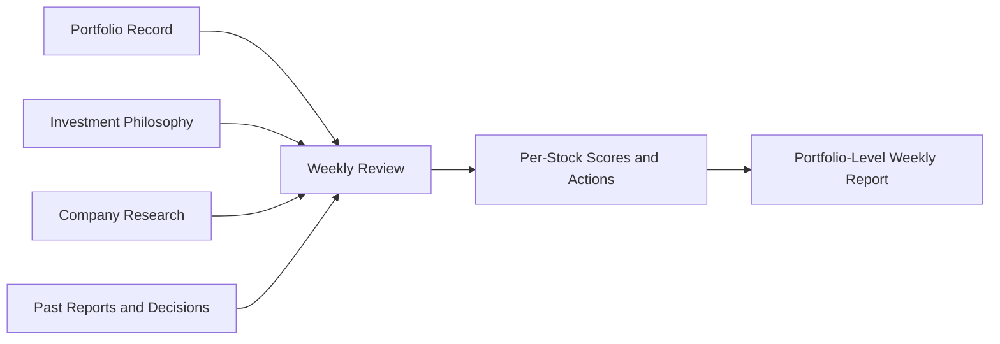

# AI Portfolio Manager

This repository is aimed at a simple idea: build a portfolio manager that helps a long-term investor review holdings with discipline, consistency, and memory.

The goal is not to automate trading. The goal is to create a weekly decision system that understands the portfolio, studies each holding, compares it against the investor's philosophy, and produces a clear action-oriented report.

This is still an early-stage project, so this README focuses on the product and analysis model we are aiming for rather than implementation details.

## Development Status

We are building this iteratively. Here is our visual timeline of milestone "beads":

🟢 **M0** ➔ 🟢 **M1** ➔ ⚪ **M2** ➔ ⚪ **M3** ➔ ⚪ **M4** ➔ ⚪ **M5** ➔ ⚪ **M6** ➔ ⚪ **M7** ➔ ⚪ **M8** ➔ ⚪ **M9** ➔ ⚪ **M10** ➔ ⚪ **M11** ➔ ⚪ **M12** ➔ ⚪ **M13** ➔ ⚪ **M14** ➔ ⚪ **M15**

*(🟢 = Complete | 🟡 = In Progress | ⚪ = Planned)*

### Feature Milestones: What becomes usable when?

- **After M4 (Ledger & Memory):** Foundational data and scoring are ready. You can programmatically query Wealthfolio, run deterministic scores, and query the local historical ledger without LLMs.
- **After M6 (Benchmark):** The full quantitative pipeline is complete, adding corporate actions and benchmark alpha calculations.
- **After M9 (Research Phase):** You can run automated, end-to-end single-stock research (fundamentals and qualitative news) through the agent.
- **After M13 (Report Phase):** The core product works for India. The agent can synthesize research, run cross-persona debates, and generate the weekly action-oriented markdown report.
- **After M14 (Full Integration):** The system is stress-tested for parallel processing, meaning you can safely run your entire portfolio.
- **After M15:** US market support is activated.

## What We Want This To Become

We want a local-first portfolio review system for Indian and US equities that can:

- keep track of the portfolio as it actually exists
- review every holding on a recurring basis
- judge each stock against a written investing philosophy
- explain what changed since the last review
- recommend what deserves action now and what deserves patience

The output should feel less like a dashboard and more like a thoughtful weekly investment memo.

## General Architecture We Are Aiming For

At a high level, the system has five parts:

1. **Portfolio record**
   This is the source of truth for what we own, how much we own, what price we bought at, and how the portfolio has changed over time.

2. **Investment philosophy**
   This is the rulebook. It defines what kind of businesses belong in the portfolio, what risks are acceptable, what position sizes are reasonable, and what should trigger a review, trim, or exit.

3. **Research layer**
   This is where each holding is studied. The system should gather the most important facts about the business, its financial performance, valuation, and recent developments.

4. **Decision layer**
   This turns raw research into judgment. It should answer questions like:
   - Is the business still strong?
   - Is the original thesis still intact?
   - Is the stock expensive for good reasons, or is quality slipping?
   - Should we hold, add, trim, or exit?

5. **Memory and reporting**
   Every review should leave behind a usable record so future reviews can compare against past conclusions instead of starting from zero each time.

In plain English: the portfolio tells us what we own, the philosophy tells us what we want to own, the research tells us what is happening, and the review layer decides whether the two still match.

## How The Financial Analysis Should Happen

The financial analysis is intended to happen in a structured sequence, not as a vague summary.

### 1. Start With The Actual Portfolio

Each review begins with a snapshot of the current portfolio. That gives the system the real holdings, position sizes, cost basis, allocation, and current gain or loss.

This matters because analysis should always start from the real portfolio we are managing, not from a generic watchlist.

### 2. Read The Thesis Behind Each Holding

For each stock, the system should know why it is in the portfolio in the first place.

That thesis becomes the benchmark for future reviews:

- Is the original idea still valid?
- Has execution improved or weakened?
- Has the market opportunity become larger or smaller?
- Is the company behaving the way we expected?

### 3. Judge The Fundamentals

This is the core of the analysis.

For a normal company, the review should focus on things like:

- revenue growth
- profit growth
- margins
- return on capital
- balance-sheet strength
- cash-flow quality
- promoter or ownership quality where relevant

For banks and financial businesses, the analysis should shift toward the metrics that matter more for them, such as asset quality, capital strength, profitability, and deposit or lending quality.

The aim is to answer one central question: is this still a fundamentally healthy business?

### 4. Judge The Business Story

Numbers alone are not enough. The system should also review the business itself:

- Does the company still have a meaningful growth runway?
- Is its competitive advantage getting stronger or weaker?
- Does management appear credible and disciplined?
- Are there governance concerns?
- Is the company gaining or losing its strategic position?

This part matters because a stock can look optically cheap while the business quality is deteriorating underneath.

### 5. Look At Valuation In Context

Valuation should matter, but it should not dominate the whole conclusion.

The intended approach is:

- strong business + rich valuation = usually patience, not panic
- weak business + rich valuation = bigger concern
- price weakness alone = trigger deeper review, not automatic sell

In other words, valuation helps shape timing and conviction, but fundamentals and thesis quality should carry more weight.

### 6. Review Recent Developments

Each holding should also be checked for recent events:

- earnings surprises
- management commentary
- regulatory developments
- capital allocation decisions
- major negative news
- industry shifts that affect the original thesis

The purpose is not to react to every headline. The purpose is to catch information that changes the actual investment case.

### 7. Turn Analysis Into A Clear Judgment

After reviewing the business, the system should convert all of that into an interpretable result for each holding:

- overall score or rating
- confidence level
- status of the thesis
- what improved
- what weakened
- what action, if any, is justified

The intended actions are simple:

- `Hold`
- `Hold with conviction`
- `Accumulate`
- `Trim`
- `Exit`

### 8. Step Back To Portfolio Level

Good stock analysis is not enough on its own. The system should then zoom out and ask:

- Are we too concentrated in one sector or theme?
- Are there positions that are too small to matter or too large for the risk?
- Are we holding lower-quality businesses while better opportunities exist?
- Are there actions we should take gradually over time rather than immediately?

This is where single-stock analysis becomes actual portfolio management.

## Principles Behind The Analysis

The intended analysis model is guided by a few simple principles:

- **Fundamentals first.** Business quality matters more than short-term price movement.
- **Philosophy-driven.** The system should judge stocks against the investor's own framework, not generic market commentary.
- **Conservative action bias.** Most weeks should lead to better understanding, not unnecessary trading.
- **Price drops trigger review.** A falling stock should force deeper analysis, not an emotional sell.
- **The human makes the final call.** The system should support decisions, not execute them.

## What A Good Weekly Output Should Feel Like

A good weekly report should answer:

- What do we own?
- Which holdings are getting stronger?
- Which holdings are weakening?
- What deserves action now?
- What deserves patience?
- How well does the portfolio still match the intended philosophy?

If the system does that consistently, it becomes useful even before it becomes technically sophisticated.

## Current Direction

The project is still defining and shaping this workflow. Right now, the important thing is to be clear about the kind of portfolio manager we want to build:

- one that is philosophy-aware
- one that is fundamentals-led
- one that evaluates both stocks and the portfolio as a whole
- one that leaves behind a durable record of decisions and reasoning

That is the architecture we are aiming toward.
