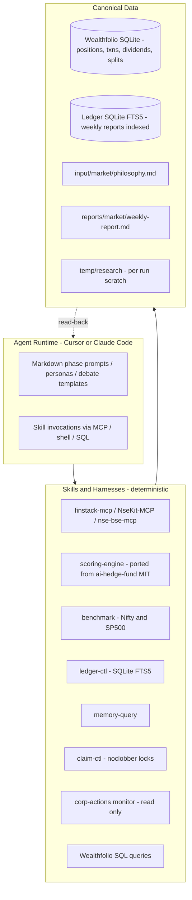

# SPEC.md — Local-First AI Portfolio Manager

> **Status**: v1.2 — active implementation spec. Companion documents: [current.md](../research/archive/pre-v1.2-design/current.md) (current implementation), [research/archive/pre-v1.2-design/1.md](../research/archive/pre-v1.2-design/1.md), [research/archive/pre-v1.2-design/2.md](../research/archive/pre-v1.2-design/2.md) (external OSS landscape research).
>
> **Audience**: This spec is written to be executable by an AI coding agent (Cursor / Claude Code) that will later implement each component, and human-readable for architectural review.

---

## Table of Contents

1. [Purpose & Non-Goals](#1-purpose--non-goals)
2. [Design Principles](#2-design-principles)
3. [Scope](#3-scope)
4. [Architecture](#4-architecture)
5. [Tracker Layer — Wealthfolio](#5-tracker-layer--wealthfolio)
6. [Skills Catalog](#6-skills-catalog)
7. [Data Model](#7-data-model)
8. [Philosophy & Personas](#8-philosophy--personas)
9. [Scoring System](#9-scoring-system)
10. [Workflow Phases](#10-workflow-phases)
11. [Debate Protocol](#11-debate-protocol)
12. [Memory & Ledger](#12-memory--ledger)
13. [Corporate Actions Monitoring](#13-corporate-actions-monitoring)
14. [Benchmarking](#14-benchmarking)
15. [Data Sources & Fallback Chain](#15-data-sources--fallback-chain)
16. [Output Formats](#16-output-formats)
17. [Directory Layout](#17-directory-layout)
18. [Skill Contracts](#18-skill-contracts)
19. [Quality Gates & Invariants](#19-quality-gates--invariants)

---

## 1. Purpose & Non-Goals

### 1.1 Purpose

Build a **local-first, AI-driven portfolio manager** for a long-term (1–3 year horizon) rotating investor trading Indian (NSE/BSE) and US (NYSE/NASDAQ) equities. The system:

- Maintains a **durable tracker** of transactions, positions, dividends, and corporate actions (replacing today's Google-Sheet snapshot).
- Runs **weekly structured research** on every holding — fundamentals, valuation, qualitative business story, news — driven by a philosophy the user has written down.
- Produces a **philosophy-aligned, auditable weekly report** with a graded 0-100 score per holding, a prioritized action plan, and a rolling memory of past runs.
- Uses **Cursor / Claude Code as the agent runtime**; all LLM reasoning happens inside the IDE agent session. Our code contains zero LLM API calls.
- Treats **public OSS projects as skills/harnesses** — Wealthfolio as the tracker, MCP servers (finstack-mcp, NseKit-MCP, nse-bse-mcp) for market data, `virattt/ai-hedge-fund` as source of deterministic scoring & persona logic — rather than reimplementing them.

### 1.2 Non-Goals

The system explicitly does **not**:

- **Execute trades**. No broker integration, no order placement, no automated rebalancing. The weekly report recommends actions; the user executes them manually in their broker app.
- **Host LLMs or call LLM APIs from code**. The agent is the Cursor/Claude session; Python/Go/shell skills are pure deterministic code.
- **Manage tax lots for optimization**. LTCG/STCG-aware trade planning is out of MVP.
- **Support intraday / day-trading / F&O**. Horizon is 1–3 years; F&O tooling in the chosen MCPs is ignored.
- **Cover non-equity asset classes** beyond cash in MVP. Crypto, real estate, bonds, and options are out of scope.
- **Provide a custom UI**. Wealthfolio's built-in desktop/web UI covers visualization. The agent's output is markdown.
- **Reimplement tracking mechanics** (cost basis, split adjustment, dividend accounting) — Wealthfolio owns all of this.
- **Run autonomously in the background**. All runs are user-initiated (weekly cadence).

---

## 2. Design Principles

The system is opinionated. These principles supersede individual feature decisions when they conflict.

1. **Local-first, zero-subscription core.** All state lives on the user's machine. No cloud service is required to run the system. Wealthfolio Connect and any paid LLM subscriptions are optional.
2. **Cursor/Claude is the agent.** The LLM runtime is the IDE. Skills are deterministic tools the agent invokes. We never write code that calls an LLM API.
3. **Public OSS over reimplementation.** If a mature public project does the job (tracker, MCP for market data, scoring logic), we adopt it with attribution. Rebuilds require explicit justification.
4. **Filesystem is the message bus.** Inter-phase communication happens through files in `temp/research/` and the ledger DB. Phase 1 freezes portfolio-state inputs into local artifacts (`portfolio-snapshot.csv`, warnings) that later phases must treat as authoritative for holdings state. No in-memory state persists between agent sessions. Inherited from current.md §8.
5. **Fundamentals-first, valuation second.** Valuation alone cannot push a stock below "Conviction Hold". An expensive but fundamentally sound stock remains a hold. Inherited from current.md §6.
6. **Deterministic where possible, LLM where necessary.** Numbers, thresholds, pass/fail checks, SQL queries, attribution math — deterministic code. Synthesis, persona reasoning, debate — LLM. The scoring engine is pure math; the `[AI]` synthesis line is LLM.
7. **Claim-based parallelism, no orchestrator.** Phases 2, 4, 5 shard across concurrent Cursor sessions via atomic `noclobber` file locks. Batch size is user-configurable; each session claims one batch, processes it, stops. Inherited from current.md §8.
8. **Auditable outputs.** Every number carries a period annotation ("Q3 FY26", not "latest"); every source carries a tier-graded citation with access date; every scoring decision is traceable to a specific threshold pass/fail. Inherited from current.md §7.4.
9. **Schema stability through versioning.** External schemas we depend on (Wealthfolio SQLite, MCP tool signatures) are pinned to exact versions in `THIRD_PARTY.md` and versioned SQL files. Upgrades are deliberate.
10. **Philosophy as source of truth.** `input/{market}/philosophy.md` drives scoring, persona weighting, action thresholds, and exit rules. Changing the philosophy changes the system's behavior without code changes.
11. **Price drops are review triggers, not sell signals.** A −15% or −20% drop triggers a deeper fundamental review, never an automatic exit. Inherited from current.md §6.
12. **Conservative action bias.** Immediate actions capped at 2 per run. Most holdings receive "Hold" or "Patience Required" because most weeks do not require trades. Inherited from current.md §6.

---

## 3. Scope

### 3.1 Markets

- **India — NSE & BSE** — first-class. Ticker format: Yahoo suffix `.NS` (NSE) or `.BO` (BSE). Default market when ambiguous.
- **US — NYSE & NASDAQ** — first-class. No suffix.
- **Other exchanges** — not supported in MVP.

### 3.2 Asset classes (MVP)

- Listed equities (stocks and ETFs).
- Cash (in INR and USD, tracked inside Wealthfolio as `$CASH-INR`, `$CASH-USD` per Wealthfolio conventions).

**Out of MVP**: mutual funds, bonds, crypto, gold/commodities, F&O, real estate.

### 3.3 Horizon & cadence

- **Holding horizon**: 1–3 years typical; capital rotation when thesis breaks or better opportunity identified.
- **Minimum holding**: 6 months (philosophy-enforced).
- **Run cadence**: weekly (user-initiated). Ad-hoc runs allowed for corporate events or sharp drawdowns.
- **Rebalance cadence**: gradual, over 3–6 months. ≤2 sells per week per philosophy.

### 3.4 Run scope model

Every run accepts a scope and writes a normalized portfolio snapshot CSV before research begins.

- `scope_type=market` + `scope_value=india|us` — aggregate all active accounts for that market.
- `scope_type=account_group` + `scope_value=<group-name>` — aggregate active accounts in a named Wealthfolio account group.
- `scope_type=account` + `scope_value=<account-name>` — analyze a single Wealthfolio account in isolation.

MVP default is `scope_type=market`. Phase 1 shows the generated snapshot to the user, but it is not a mandatory confirmation gate. The dumped snapshot becomes the frozen portfolio-state input for the run; later phases may fetch fresher market data, but they do not mutate the frozen snapshot.

### 3.5 Actions produced

Every holding receives one of:

- `Hold` — no change required
- `Hold-with-Conviction` — price weakness but fundamentals intact; no action
- `Accumulate` — add on current price levels
- `Trim` — reduce position size
- `Exit` — sell entire position (only for confirmed thesis breaks, ≤2 per run)

And every run produces a four-tier action plan:

| Tier | Horizon | Use For | Cap |
|---|---|---|---|
| Immediate | This week | Confirmed fundamental thesis breaks | **max 2 per run** |
| Short-term | 1–4 weeks | Tactical rebalance / trim / accumulate | — |
| Long-term | 1–3 months | Strategic shifts, new positions, gradual exits | — |
| Patience Required | No action | Fundamentally sound stocks in temporary weakness | — |

### 3.6 User roles

- **Human investor (single user)** — maintains philosophy, enters transactions in Wealthfolio, initiates weekly runs, reads reports, places trades.
- **Cursor/Claude agent** — reads philosophy + tracker + prior ledger + fundamentals; produces research, scores, synthesis, report.
- **No shared / multi-user mode** in MVP.

---

## 4. Architecture

### 4.1 Layer diagram



### 4.2 Layer responsibilities

**Agent layer (Cursor / Claude Code)**
- Owns all LLM reasoning: research synthesis, qualitative scoring, persona evaluation, bull/bear debate, report assembly.
- Reads markdown phase prompts from `.agents/phases/` and personas from `.agents/personas/`.
- Invokes skills via MCP tool calls, shell commands, or direct `sqlite3` CLI calls.
- Writes structured outputs (per-stock `[Tag]` files, portfolio analysis, weekly report) to the filesystem.

**Skill layer (deterministic)**
- Contains zero LLM calls.
- Each skill is a standalone CLI (Python or Go) or MCP server with a documented input/output JSON contract.
- **Dockerized Portability:** This layer is packaged in a Docker container (`Dockerfile` + `docker-compose.yml`). The container mounts the external Wealthfolio DB (read-only) and the local `ledger/` directory as volumes, eliminating manual local environment setup.
- Skills are idempotent and re-runnable.
- Failure modes are explicit (exit codes, stderr messages, JSON `{error: ...}`).

**Data layer**
- **Wealthfolio SQLite** — canonical tracker; read-only from agent's perspective. Writes happen only through Wealthfolio UI or its CSV importer.
- **Ledger SQLite (FTS5)** — append-only history of weekly runs; indexed for full-text search.
- **`input/{market}/philosophy.md`** — user-authored philosophy, source of truth for scoring thresholds and exit rules.
- **`input/{market}/theses.yaml`** — per-market, per-ticker thesis sidecar; merged into the Phase 1 snapshot and treated as analysis input.
- **`temp/research/portfolio-snapshot.csv` + other Phase 1 artifacts** — frozen run inputs for holdings state and warnings.
- **`reports/{market}/YYYY-MM-DD-weekly-report.md`** — final output per run, human-readable.
- **`temp/research/`** — scratch space per run; per-stock `[Tag]` files, manifest, claim locks, portfolio-analysis.md. It is disposable and may be cleaned between runs; manual cleanup is acceptable in the rare case of multiple same-day runs.

### 4.3 Communication patterns

- **Agent → Skill**: MCP tool call (preferred for structured queries) OR shell command with JSON stdin/stdout OR `sqlite3` CLI for direct SQL reads.
- **Skill → Data**: filesystem reads/writes; SQL queries against Wealthfolio DB (read-only) or ledger DB (read-write).
- **Phase → Phase**: files only. Phase 1 writes the frozen run artifacts; later phases read them and add new files, but do not rewrite the frozen snapshot CSV. No shared memory.
- **Run → Run**: ledger DB rows + `context/{market}/last-run.md` short-form context. Next run reads these first.

### 4.4 Failure & resumability

- Any agent session can be killed mid-batch. `claim-ctl reclaim` releases stale `.claimed` files (older than 30 minutes) so another session can pick up the work.
- Skills are stateless and re-runnable; repeated invocations must produce the same result for the same inputs.
- Runs may span multiple days. This is safe because the portfolio-state inputs are frozen when Phase 1 writes the snapshot artifacts; later phases may add fresher market context without altering the run baseline.
- Ledger writes happen only once per run, at the end of Phase 7, atomically.
- Wealthfolio DB is never written by the system — corrupting it would require user action.

---

## 5. Tracker Layer — Wealthfolio

### 5.1 Decision: Wealthfolio is the canonical tracker

**Wealthfolio is the canonical portfolio, transaction, and corporate-action store**.

### 5.2 Why Wealthfolio

Wealthfolio is the chosen tracker because it already provides the mechanics this system depends on: transaction accounting, corporate-action handling, portfolio visualization, and a local SQLite database the agent can read safely. The spec assumes we build around Wealthfolio rather than maintaining a parallel custom tracker.

**Maintenance mode (holdings-only).** The user maintains current positions and per-lot cost basis in Wealthfolio. The agent does not require the `activities` table (transactions, dividends, corporate-action entries) to be populated and does not read from it. Any feature that would have relied on recorded activities is either removed from scope or sourced from `daily_account_valuation` snapshots instead.

### 5.2.1 Documenting Wealthfolio for Users

To ensure anyone picking up this repo can easily run it, `config/wealthfolio.md` serves as the primary onboarding document for the tracker. It must clearly outline:
1. Where to download and install the Wealthfolio native app.
2. How to find the hidden `wealthfolio.sqlite` database file based on the operating system.
3. How to mount that SQLite file into the `docker-compose.yml` so the Dockerized agent runtime has secure read access.

### 5.3 How the agent uses Wealthfolio

- **Reads**: via direct SQL queries against Wealthfolio's SQLite DB. Queries live in `skills/sql/wealthfolio-queries.sql` and are versioned alongside the installed Wealthfolio release. Typical queries:
  - `export-snapshot(scope)` → normalized CSV rows for the chosen run scope, including thesis merge
  - `list-holdings` → `(symbol, currency, quantity, avg_cost, current_price, market_value, allocation_pct)`
  - `get-cash-balance(currency, scope)` → available cash within the selected run scope
  - `get-net-worth(date)` → total portfolio value at date (Wealthfolio has time-travel data)
- **Writes**: the agent **never writes** to Wealthfolio's DB. New positions flow through:
  1. User manual entry in Wealthfolio UI (for individual trades).
  2. Broker CSV export → Wealthfolio CSV import wizard (for batch imports; Wealthfolio saves per-broker column mappings).
  3. For corp-action events surfaced by `corp-actions-monitor` (§13), the agent writes an informational digest; the user decides whether any action is needed. **Agent does not write the DB directly.**

### 5.4 Run-entry export model

The preferred Phase 1 entry path is a normalized export generated by our tooling, not a hand-curated CSV.

- `wealthfolio-query export-snapshot` is the default path. It applies the selected scope, reads only active accounts, merges the per-market thesis sidecar, and writes the lean snapshot schema from §7.1.1.
- Native Wealthfolio exports remain useful for manual validation or troubleshooting, but the AI workflow should not assume Wealthfolio already provides the exact filtered analysis snapshot we need.
- The snapshot must reflect the latest prices available at export time. If quote refresh is a separate step in the installed Wealthfolio release, the Phase 1 workflow must perform that refresh before exporting.

---

## 6. Skills Catalog

All skills are deterministic code (no LLM calls). Each has: purpose, OSS source, input/output contract, failure modes, invoking phase. Full CLI signatures in §18.

| Skill | Purpose | OSS Source | Primary Invoker |
|---|---|---|---|
| `fundamentals-fetch` | Get per-stock quantitative fundamentals | finstack-mcp (primary) + nse-bse-mcp (fallback) | Phase 2 |
| `corp-actions-monitor` | Read-only detection of recent/upcoming corp actions for held tickers | NseKit-MCP + Yahoo | Phase 1 |
| `scoring-engine` | Deterministic pass/fail on philosophy thresholds; per-persona base scores | Ported from `virattt/ai-hedge-fund` (MIT) | Phase 4 |
| `benchmark` | Pull Nifty/S&P data; compute alpha vs benchmark | `yfinance` wrapper | Phase 6 |
| `ledger-ctl` | Append-only SQLite FTS5 ledger writes/queries | Custom thin wrapper | Phase 7 |
| `memory-query` | FTS search over past reports | SQLite FTS5 | Phase 1 |
| `claim-ctl` | Atomic per-stock claim locks for parallel phases | Inherited verbatim from current.md | Phases 2, 4, 5 |
| `wealthfolio-query` | Parameterized SQL against Wealthfolio DB | `sqlite3` CLI + versioned SQL file | Phase 1 |

### 6.1 `fundamentals-fetch` (primary quantitative data)

- **Primary OSS**: [finstacklabs/finstack-mcp](https://github.com/finstacklabs/finstack-mcp) — 58 tools, MIT, no API keys. Covers India (NSE/BSE) + global + SEC EDGAR. Tools include income statement, balance sheet, cash flow, key ratios (P/E, ROE, margins, D/E, growth), FII/DII flows, mutual fund NAV.
- **Secondary**: [Prasad1612/NseKit-MCP](https://github.com/Prasad1612/NseKit-MCP) — 100+ NSE tools; used primarily for corp-actions and FII/DII.
- **Tertiary**: [bshada/nse-bse-mcp](https://github.com/bshada/nse-bse-mcp) — 60 tools (TypeScript, MIT) for live quotes + document download (filings, IPO prospectus).
- **Invocation**: MCP tool calls from the Cursor/Claude agent session. The user registers these MCP servers in their Cursor/Claude config.
- **Output contract**: normalized JSON matching the `[Fund]` schema defined in §7.3.
- **Failure modes**:
  - MCP server returns partial data → agent marks missing fields as `N/A`.
  - All MCPs fail for a ticker → agent falls back to web search (Tier-3 in §15).
  - Rate limit → agent retries after configured backoff.

### 6.2 `corp-actions-monitor` (read-only)

- **Source**: NseKit-MCP `corporate_events` tool (India), Yahoo Finance (US).
- **Behavior**:
  1. Loads held tickers from `temp/research/portfolio-snapshot.csv`.
  2. Queries upcoming (+14d) and recent (−90d) corp actions per ticker from NseKit-MCP (India) / Yahoo (US).
  3. Writes `temp/research/warnings/corp-actions.md` as an **informational digest**: `(ticker, date, event_type, source, note)`.
  4. Never writes to Wealthfolio's DB and never reads the `activities` table.
- **No severity classification.** Every event is informational. In holdings-only mode there is no recorded-activity baseline to diff against, so the reconciliation / severity ladder (`info`/`high`/`manual_review`) is out of scope.
- **Failure modes**: if NseKit-MCP is down, falls back to Yahoo `actions` endpoint (covers splits + dividends but not bonuses well for India). Flags the degradation in output.

### 6.3 `scoring-engine` (ported from ai-hedge-fund)

- **Source**: [`virattt/ai-hedge-fund`](https://github.com/virattt/ai-hedge-fund) (MIT, 50k stars). Specific files to port:
  - `src/agents/fundamentals.py` — threshold-based bull/bear signal counting.
  - `src/agents/phil_fisher.py` — weighted sub-score pattern (Growth 30% / Margins 25% / Mgmt 20% / Valuation 15% / Insider 5% / Sentiment 5%).
  - `src/agents/risk_manager.py` — volatility + correlation position limits (used in §9.5 concentration sanity check).
  - `src/agents/{ben_graham,warren_buffett,charlie_munger,phil_fisher,mohnish_pabrai,rakesh_jhunjhunwala,aswath_damodaran,peter_lynch}.py` — persona sub-scoring modules.
- **Attribution**: `THIRD_PARTY.md` lists each ported file with its upstream commit SHA and MIT license text.
- **Contract**: CLIs read JSON input (metrics + ticker + market) and emit JSON output (sub-scores, pass/fail table, rationale strings). No LLM.
- **Philosophy-override**: user's `philosophy.md` provides threshold overrides via a parsed front-matter config. User's thresholds win over the defaults from `fundamentals.py`.

### 6.4 `benchmark`

- **Source**: `yfinance` (already a dep of finstack-mcp).
- **Tickers**: `^NSEI` (Nifty 50), `^GSPC` (S&P 500), configurable per market.
- **Computation**: Time-Weighted Return (TWR) of portfolio vs benchmark over rolling windows (1w / 1m / 3m / 1y / 3y / since-inception). Alpha = portfolio TWR − benchmark TWR.
- **Output**: single-number alpha per window for inclusion in the weekly report and ledger.

### 6.5 `ledger-ctl`

- **Thin wrapper** around `sqlite3` CLI.
- **Operations**: `init`, `append-run`, `get-run(id)`, `list-runs(market, limit)`, `search(query, market)`.
- **Schema**: see §7.4.
- **No LLM**. Append-only; no updates or deletes (historical immutability).

### 6.6 `memory-query`

- **MVP**: SQLite FTS5 full-text search over `ledger.report_fts` virtual table.
- **Input**: search query + optional market filter + optional date window.
- **Output**: ranked list of `(run_id, date, snippet, relevance_score)`.

### 6.7 `claim-ctl`

Inherited verbatim from current.md §8. Shell scripts using `set -o noclobber` for atomic per-stock lock acquisition. Sub-commands:

- `claim-stocks <batch-size> <agent-id>`
- `complete-stock <ticker> [<ticker>...]`
- `check-progress`
- `reclaim-stale [<minutes>]`
- `claim-scoring`, `complete-scoring`, `check-scoring-progress`, `reclaim-scoring-stale` (Phase 4 variants)
- `claim-persona`, `complete-persona`, etc. (Phase 5 variants, new in this SPEC)

Default batch size is 10, but Phase 2 / 4 / 5 batch size is explicitly user-configurable.

### 6.8 `wealthfolio-query`

- **Wrapper** around `sqlite3` CLI against Wealthfolio's SQLite file.
- **Operations**: named parameterized queries defined in `skills/sql/wealthfolio-queries.sql`, versioned alongside the installed Wealthfolio release.
- **Sub-commands** (named, not free-form SQL):
  - `export-snapshot --market <india|us> --scope-type <market|account_group|account> --scope-value <value> [--theses <path>] [--output <csv>]`
  - `list-holdings [--market <IN|US>] [--scope-type ...] [--scope-value ...]`
  - `get-cash-balance [--currency <INR|USD>] [--scope-type ...] [--scope-value ...]`
  - `get-net-worth [--date <YYYY-MM-DD>]`
  - `get-avg-cost <ticker>`
  - `get-portfolio-twr --market <india|us> --start <date> --end <date>` (reads `daily_account_valuation` snapshots; independent of the `activities` table)
- **Read-only**. Uses `sqlite3 -readonly` mode.
- **Output**: JSON rows by default; CSV available via `--format csv`. `export-snapshot` writes the normalized Phase 1 snapshot schema from §7.1.1. When `--output <path>` is supplied, the wrapper writes the file and exits silently — preview rows are not echoed. When `--output` is omitted, the CSV is streamed to stdout instead.

---

## 7. Data Model

### 7.1 Overview

Seven local data stores/artifacts, using SQLite, markdown, YAML, and CSV:

1. **Wealthfolio DB** — external, read-only for us. Schema pinned in §5.6.
2. **Ledger DB** — our append-only history. Schema in §7.4.
3. **`philosophy.md`** — user-authored, markdown with optional YAML front-matter for thresholds.
4. **`theses.yaml`** — per-market, per-ticker thesis sidecar. Schema in §7.1.2.
5. **`portfolio-snapshot.csv`** — frozen Phase 1 holdings snapshot for the run. Schema in §7.1.1.
6. **`[Tag]` stock file** — per-stock research artifact. Schema in §7.3.
7. **Context ledger** — `context/{market}/last-run.md`; bounded markdown. Schema in §7.5.

#### 7.1.1 Normalized run snapshot CSV

Phase 1 writes `temp/research/portfolio-snapshot.csv` and treats it as the frozen portfolio-state input for the run. The schema is intentionally lean:

| Column | Meaning |
|---|---|
| `ticker` | Canonical Yahoo-style symbol (`RELIANCE.NS`, `AAPL`) |
| `name` | Display name from Wealthfolio |
| `market` | `india` or `us` |
| `currency` | Native trading currency |
| `account` | Wealthfolio account name |
| `account_group` | Wealthfolio account group, if any |
| `asset_type` | `stock` or `ETF` |
| `quantity` | Quantity held at snapshot time |
| `avg_cost` | Average cost basis used for drawdown comparisons |
| `snapshot_price` | Stored valuation price at snapshot export time |
| `snapshot_market_value` | Market value at snapshot export time |
| `allocation_pct` | Portfolio weight within the selected run scope |
| `unrealized_pl_pct` | Unrealized P/L percentage vs `avg_cost` |
| `thesis` | Thesis text merged from `input/{market}/theses.yaml`, or empty string |

Portfolio-state inputs are frozen once this file is written. Later phases may fetch fresher market data, but that data must flow into ticker research files or downstream analysis artifacts rather than rewriting the snapshot CSV.

#### 7.1.2 Thesis sidecar

`input/{market}/theses.yaml` is the explicit MVP source of truth for per-ticker thesis text.

- Thesis is keyed by canonical Yahoo ticker.
- Missing thesis is valid and treated as empty.
- The sidecar is per-market, not global.
- The file is structured for deterministic script merges; the thesis body itself remains free-text.

Suggested MVP shape:

```yaml
theses:
  RELIANCE.NS: "Core India energy + retail + telecom compounding thesis..."
  AAPL: "Ecosystem lock-in, services mix shift, buybacks, premium brand durability..."
```

### 7.2 Wealthfolio access model

The implementation reads a small, versioned subset of Wealthfolio's schema through named queries in `skills/sql/wealthfolio-queries.sql`. The spec does not treat table and view names as normative; the query file is the compatibility layer and must be updated deliberately whenever the installed Wealthfolio release changes.

### 7.3 `[Tag]` stock file schema

Each stock's research file at `temp/research/stocks/{TICKER}.md` uses a dense, one-line-per-tag format. Inherited from current.md §5.1 with extensions.

```
# {STOCK_NAME} ({TICKER})
[Overview] Sector: … | MCap: … | Qty: … | Avg: ₹… | LTP: ₹… | P/L: …% | Inv: … | Val: … | Alloc: …%
[Fund]     Rev YoY: …% (Q3 FY26) | Rev QoQ: … | PAT YoY: … | PAT QoQ: … | D/E: … | Prom: …% (Pledge: …%)
           | ROE: …% | ROCE: …% | OPM: …% | NPM: …%
           { banking/NBFC only: | GNPA | NNPA | CASA | NIM | ROA | CAR }
[Valu]     PE: … (5Y: L–H, Med: M) vs Sec: … | PB: … | FII: …% (Δ) | DII: …% (Δ)
           | 100d: … | 200d: … | Supp: … | Res: … | 52w: … (H: … L: …)
[Biz]      Runway: … | Moat: … | Mgmt: … | CapEx: … | Shr: …
[News]     {date}: {headline} ({source}) | …
[Phil]     Thesis: {user thesis or "—"} | Meets: ROE(18.3%), ROCE(23.8%), D/E(~0)…
           | Fails: PATGr(8.2%<10%)…
[Prev]     {diff vs last run, or "> No prior context for this stock."}
[Sources]  Fund: … | Valu: … | Biz: … | News: …
```

**New in this SPEC**: after Phase 4 appends `## Scoring`, Phase 5 appends `## Persona Cross-Check`, and (if triggered) Phase 6 appends `## Debate`.

```
---
## Scoring
Score: {0-100} {Rating} [{HIGH|MEDIUM|LOW}]
Sub: F:{f}/35 | BS:{b}/20 | V:{v}/20 | N:{n}/10 | PF:{p}/15
Rationale: {1-2 sentences per sub-score, pipe-delimited}
Action: {Hold | Accumulate | Trim | Exit | Hold-with-Conviction}
[AI] {2–5 line analytical synthesis bridging all dimensions}
Notes: {any fundamentals-first adjustments or verification flags}

## Persona Cross-Check
my-philosophy: {Accumulate | Hold | Hold-with-Conviction | Trim | Exit} — {1-line rationale}
{persona-2}:   {action} — {1-line rationale}
{persona-3}:   {action} — {1-line rationale}
Consensus: {unanimous | majority | split}
Flags: {debate-trigger-reason or "none"}

## Debate  (only present if triggered per §11)
Round 1:
  Bull: {2-3 sentences with specific evidence}
  Bear: {2-3 sentences with specific evidence}
Round 2 (if rebuttal warranted):
  Bull rebuttal: {1-2 sentences addressing bear's strongest point}
  Bear rebuttal: {1-2 sentences addressing bull's strongest point}
Resolution: {final action + 1-sentence reason}
```

Hard rules (inherited from current.md §5.1, kept): no markdown tables in data blocks, no bulleted lists in data lines, 10–15 lines total for pre-scoring section, every metric carries a period annotation (`Q3 FY26`, `FY25`, not `Latest`/`Current`/`TTM`), source citations include access date + tier.

Snapshot-derived portfolio fields (`quantity`, `avg_cost`, `snapshot_price`, `snapshot_market_value`, `allocation_pct`, `unrealized_pl_pct`, `thesis`) must come from `portfolio-snapshot.csv` and remain stable for the duration of the run. If later phases fetch fresher live market context, they add it to the stock file without rewriting the frozen snapshot baseline.

### 7.4 Ledger DB schema (SQLite FTS5)

```sql
-- one row per weekly run
CREATE TABLE runs (
    id            INTEGER PRIMARY KEY,
    market        TEXT NOT NULL CHECK (market IN ('india', 'us')),
    scope_type    TEXT NOT NULL CHECK (scope_type IN ('market', 'account_group', 'account')),
    scope_value   TEXT NOT NULL,
    run_date      TEXT NOT NULL,           -- YYYY-MM-DD
    philosophy_hash TEXT NOT NULL,          -- sha256 of philosophy.md; change => review
    overall_confidence TEXT CHECK (overall_confidence IN ('HIGH','MEDIUM','LOW')),
    stock_count   INTEGER,
    portfolio_value REAL,
    benchmark_alpha_1w REAL,                -- portfolio TWR - benchmark TWR, 1-week
    benchmark_alpha_1m REAL,
    benchmark_alpha_1y REAL,
    created_at    TEXT DEFAULT CURRENT_TIMESTAMP
);

-- one row per action produced in a run
CREATE TABLE actions (
    id            INTEGER PRIMARY KEY,
    run_id        INTEGER NOT NULL REFERENCES runs(id),
    priority      TEXT NOT NULL CHECK (priority IN ('immediate','short_term','long_term','patience_required')),
    ticker        TEXT NOT NULL,
    action        TEXT NOT NULL,
    rationale     TEXT NOT NULL,
    business_story_status TEXT CHECK (business_story_status IN ('intact','weakening','broken')),
    score         INTEGER CHECK (score >= 0 AND score <= 100),
    created_at    TEXT DEFAULT CURRENT_TIMESTAMP
);

-- per-stock scoring snapshot for historical analysis
CREATE TABLE stock_scores (
    id            INTEGER PRIMARY KEY,
    run_id        INTEGER NOT NULL REFERENCES runs(id),
    ticker        TEXT NOT NULL,
    score         INTEGER NOT NULL,
    rating        TEXT NOT NULL,
    sub_fundamental INTEGER,
    sub_business_story INTEGER,
    sub_valuation INTEGER,
    sub_news      INTEGER,
    sub_philosophy_fit INTEGER,
    confidence    TEXT,
    action        TEXT
);

-- persona assessments per run per stock
CREATE TABLE persona_assessments (
    id            INTEGER PRIMARY KEY,
    run_id        INTEGER NOT NULL REFERENCES runs(id),
    ticker        TEXT NOT NULL,
    persona       TEXT NOT NULL,           -- 'my-philosophy', 'jhunjhunwala', 'buffett', ...
    action        TEXT NOT NULL,
    rationale     TEXT NOT NULL
);

-- FTS5 virtual table over full report content for memory-query
CREATE VIRTUAL TABLE report_fts USING fts5(
    content,
    tokenize='porter',
    content='runs',
    content_rowid='id'
);

-- indexes
CREATE INDEX idx_actions_ticker ON actions(ticker);
CREATE INDEX idx_actions_priority ON actions(priority);
CREATE INDEX idx_stock_scores_ticker ON stock_scores(ticker, run_id);
CREATE INDEX idx_persona_ticker ON persona_assessments(ticker, run_id);
CREATE INDEX idx_runs_market_date ON runs(market, run_date);
```

### 7.5 Context ledger (short-form) schema

`context/{market}/last-run.md` — ≤100 lines, overwritten each run (previous copied to `last-run-backup.md` first). Inherited from current.md §4.3 with minor schema tweaks:

```
# {MARKET} — {DATE} — Context Ledger

## Run Summary
- Stock count: N
- Portfolio value: ₹ / $ …
- Scope: market|account_group|account = …
- Overall confidence: HIGH/MEDIUM/LOW
- Benchmark alpha (1y): +/-X.X%

## Portfolio Snapshot
{Top-5 + bottom-5 holdings with allocation + score}

## Key Alerts
### Concerning
| Ticker | Flag | Score | Action |
|---|---|---|---|

### Opportunities
| Ticker | Signal | Score | Action |
|---|---|---|---|

## Open Action Items (carried forward until portfolio evidences action)
| Ticker | Action | Since | Reason |
|---|---|---|---|

## Price Levels to Watch (only within 5-10% of current price)
| Ticker | Level | Trigger |
|---|---|---|

## Philosophy Alignment
- Score: X/100
- Top gaps: …
```

### 7.6 Philosophy file schema

`input/{market}/philosophy.md` has two parts:

1. **YAML front-matter** (new in this SPEC, optional but recommended) — machine-readable thresholds used by `scoring-engine`:

```yaml
---
market: india
version: 2
thresholds:
  non_financial:
    roe_min: 12
    roce_min: 12
    de_max: 1.0
    promoter_min: 40
    pledge_max: 10
    revenue_cagr_3y_min: 10
    profit_cagr_3y_min: 10
    fcf_positive: true
    mcap_min_cr: 5000
  banking_nbfc:
    roa_min: 1.0
    roe_min: 12
    nnpa_max: 1.5
    car_min: 15
    casa_min: 30
    nim_min: 3.0
    profit_growth_min: 10
    promoter_min: 30
    pledge_max: 10
    mcap_min_cr: 5000
position_sizing:
  max_per_stock_pct: 8
  min_per_stock_pct: 2
  top_5_max_pct: 35
risk:
  max_drawdown_pct: 30
  small_cap_cap_pct: 20
  price_drop_review_trigger_pct: 20
  position_concentration_debate_trigger_pct: 7
  price_down_debate_trigger_pct: 15
sector_exceptions:
  hospitals:     { promoter_min: 20 }
  it_mnc:        { promoter_min: 10 }
  psus:          { promoter_min: 45, applies_to: government }
  foreign_sub:   { parent_min: 40 }
  stock_exchanges: { exempt: true }
personas_enabled: [my-philosophy, jhunjhunwala, buffett, munger, pabrai]
persona_rotation: 3     # how many personas besides my-philosophy per run
---
```

2. **Markdown prose** — the full human-readable philosophy (goals, ideology, selection criteria, risk tolerance, sector targets, exit rules, transition guidelines). This is the part the LLM reads for qualitative reasoning. Existing India philosophy content from current.md §4.2 migrates verbatim.

---

## 8. Philosophy & Personas

### 8.1 Philosophy as source of truth

`input/{market}/philosophy.md` drives:

- **Deterministic thresholds** (via YAML front-matter) used by `scoring-engine`.
- **Qualitative narrative** (markdown prose) read by the agent for scoring rationale, persona reasoning, and debate framing.
- **Exit rules, trim signals, hold-through situations** used by Phase 5 (synthesis) to classify actions.
- **Position sizing limits** used by Phase 1 and Phase 5 to flag concentration violations.

The India philosophy from current.md is retained and extended with the YAML front-matter. The US philosophy (currently a template) must be filled in before `market=us` runs produce useful output.

### 8.2 Persona architecture

**Borrowed pattern**: `virattt/ai-hedge-fund` `src/agents/*.py` — each persona is a named analytical viewpoint with its own thresholds, weights, and narrative style.

**Our adaptation**: each persona is a **markdown skill file** at `.agents/personas/{persona-name}.md`, consumed by the Cursor/Claude agent in Phase 5. The persona file contains:

1. A brief "identity" paragraph (who this investor was/is, their style).
2. The specific **thresholds** this persona cares about (numerical).
3. The **weighting** of sub-criteria (e.g. Jhunjhunwala: 40% management quality, 30% secular growth, 20% valuation, 10% technical).
4. The **output format** the persona must emit (action + 1-line rationale, matching §7.3 Persona Cross-Check block).
5. **Deterministic base scoring** via `scoring-engine` CLI calls — the persona prompt says "first run `scoring-engine {persona}` and incorporate the output". This keeps the threshold math deterministic while the narrative comes from the LLM.

### 8.3 Persona roster (MVP default)

| Persona | Market fit | Primary lens | Deterministic base? |
|---|---|---|---|
| `my-philosophy` | both | User's own philosophy thresholds (YAML front-matter) | Yes — parsed from philosophy front-matter |
| `jhunjhunwala` | India | Management quality + long-duration growth + concentrated bets | Yes — ported from `rakesh_jhunjhunwala.py` |
| `buffett` | both (better US) | Moat + ROE + long-term hold + owner-like mindset | Yes — ported from `warren_buffett.py` |
| `munger` | both | Quality + mental models + inversion + "sit on your ass" patience | Yes — ported from `charlie_munger.py` |
| `pabrai` | both | "Heads I win, tails I don't lose much" + few big bets + deep value | Yes — ported from `mohnish_pabrai.py` |

**Available but not in MVP default** (enable via `personas_enabled`):

- `graham` — deep value, margin of safety, NCAV (best for deep bear markets)
- `fisher` — growth + quality (our Phase 4 uses its weight pattern already)
- `damodaran` — disciplined valuation + story-numbers reconciliation (strong US fit)
- `lynch` — "invest in what you know" + GARP (fits the 1–3 year horizon well, but is not enabled by default)
- `druckenmiller` — macro + top-down (less aligned with fundamentals-first)
- `ackman`, `burry`, `wood` — activist / contrarian / thematic (low alignment with long-term fundamental philosophy; excluded from MVP unless user requests)

### 8.4 Rotation policy

Every run: `my-philosophy` is **always evaluated** (it's the user's own thesis — non-negotiable). Additionally, `persona_rotation` other personas (default 3) are drawn from the enabled set, rotating across runs so every persona's viewpoint surfaces at least 3 out of 4 weeks. Rotation is deterministic (seeded by `run_date + market`), so a given run is reproducible.

### 8.5 Persona output contract

Every persona emits the same structure for every holding:

```
{persona-name}: {Accumulate | Hold | Hold-with-Conviction | Trim | Exit} — {≤ 1 sentence rationale citing specific metric/signal}
```

### 8.6 Philosophy-persona tension resolution

If `my-philosophy` and a rotating persona disagree, the `my-philosophy` verdict is recorded in the final action plan, but the disagreement is logged in `persona_assessments` and **triggers debate** per §11. The report's action plan will cite the disagreement.

---

## 9. Scoring System

### 9.1 0-100 rubric

| Component | Max | Weight Philosophy |
|---|---|---|
| Fundamental | 35 | Primary driver — financial health, growth quality, balance sheet |
| Business Story / Moat | 20 | Qualitative conviction — moat, sector runway, management, capex visibility |
| Valuation & Accumulation | 20 | Accumulation context only — never reduces conviction on its own |
| News/Sentiment | 10 | Short-term informational — recent catalysts, analyst actions |
| Philosophy Fit | 15 | Graduated (0/8/15) check against user's philosophy thresholds |
| **Total** | **100** | Fundamentals + Business Story = 55/100 (55%) |

Rating bands:

| Score | Label | Meaning |
|---|---|---|
| 80–100 | Strong Conviction | Core holding, accumulate on dips |
| 60–79 | Conviction Hold | Fundamentals intact, hold with patience |
| 40–59 | Under Review | Mixed signals, monitor |
| 0–39 | Fundamental Concern | Thesis may be broken, deep review required |

### 9.2 Fundamentals-first invariant (inherited)

> An expensive but fundamentally sound stock must not fall below Conviction Hold. A 35/35 + 20/20 + 20/20 + 0/15 + 0/10 = 75/100 is still Conviction Hold.

Philosophy Fit is graduated:
- 0 failures → 15
- 1–2 non-dealbreaker failures → 8
- 3+ failures OR any dealbreaker → 0

Dealbreakers (auto-zero Philosophy Fit):
- Promoter holding = 0% (unless structurally promoter-less: MCX, BSE, stock exchanges)
- Confirmed fraud, SEBI/SEC action, severe governance crisis
- User's per-stock `[Phil] Thesis` explicitly says "SELL" or "EXIT"

### 9.3 Deterministic pass/fail layer

Before the LLM produces qualitative scoring, `scoring-engine` runs deterministic checks on every metric against philosophy thresholds. Output is a pass/fail table:

```json
{
  "ticker": "INFY",
  "market": "india",
  "scheme": "non_financial",
  "checks": [
    { "metric": "roe",         "value": 28.7, "threshold": 12,  "op": ">=", "pass": true  },
    { "metric": "roce",        "value": 35.0, "threshold": 12,  "op": ">=", "pass": true  },
    { "metric": "de",          "value": 0.05, "threshold": 1.0, "op": "<=", "pass": true  },
    { "metric": "promoter",    "value": 14.5, "threshold": 40,  "op": ">=", "pass": false, "exception": "it_mnc", "effective_threshold": 10, "pass_with_exception": true },
    { "metric": "pledge",      "value": 0,    "threshold": 10,  "op": "<=", "pass": true  },
    { "metric": "rev_cagr_3y", "value": 14.2, "threshold": 10,  "op": ">=", "pass": true  },
    { "metric": "pat_cagr_3y", "value": 8.2,  "threshold": 10,  "op": ">=", "pass": false },
    { "metric": "fcf_positive","value": true, "pass": true },
    { "metric": "mcap_cr",     "value": 720000,"threshold": 5000,"op": ">=", "pass": true }
  ],
  "pass_count": 8,
  "fail_count": 1,
  "dealbreakers_triggered": [],
  "philosophy_fit_graded": 8
}
```

This becomes the authoritative source for the `[Phil]` line in the `[Tag]` file. The LLM quotes values from here rather than computing them.

### 9.4 Persona base scoring (ported from ai-hedge-fund)

Each persona runs a `scoring-engine --persona <name>` call against the same metrics JSON:

```json
{
  "ticker": "INFY",
  "persona": "jhunjhunwala",
  "sub_scores": {
    "management_quality": 8.5,
    "secular_growth": 7.0,
    "valuation": 5.5,
    "technical_context": 6.0
  },
  "weighted_score": 72,
  "max_score": 100,
  "signal": "bullish",
  "confidence": 0.72,
  "rationale": "Strong management track record (Nilekani-era governance hygiene); secular IT services growth intact; fairly valued not cheap; near 50d support."
}
```

The rationale field is generated by the LLM in Phase 5 (based on the prose in the persona file), but the `sub_scores`, `weighted_score`, and `signal` are deterministic.

### 9.5 Concentration sanity check (ported from risk_manager.py)

After Phase 4, a portfolio-level check runs once:

- **HHI** (Herfindahl-Hirschman Index) across holdings — flags over-concentration.
- **Volatility-adjusted position limit** per holding — ported from `calculate_volatility_adjusted_limit`.
- **Correlation matrix** across holdings — flags clusters of highly correlated stocks (even across different sectors).
- **Output**: `temp/research/concentration-check.md` with per-stock `(current_pct, vol_adjusted_limit, delta)` and the top-5 correlation pairs.

This is a **sanity check, not a prescriber**. It does not dictate trades; Phase 5 synthesis uses it to frame the portfolio-health section and to trigger debates (§11) on overweight positions.

### 9.6 Business story status rubric

`business_story_status` remains analyst judgment, but bounded by a shared rubric:

- `intact` — core thesis pillars still hold; no governance red flags; no material capital-allocation or execution breakdown. Weak price action or rich valuation alone cannot downgrade a stock out of this state.
- `weakening` — one or two thesis pillars are deteriorating; execution misses, margin pressure, market-share loss, or management communication issues are real but not yet conclusive.
- `broken` — governance breakdown, fraud, major regulatory action, thesis invalidation, structural balance-sheet deterioration, or repeated weakening across runs with stronger confirming evidence.

Guidance: start at `intact`, move to `weakening` when at least one thesis pillar is materially challenged, and move to `broken` only on dealbreakers or repeated weakening with stronger evidence. The rubric guides the analyst; it does not replace evidence-based judgment.

### 9.7 Confidence rubric

Confidence is rubric-based and should be explainable:

- `HIGH` — strong data completeness, recent sources, no major conflicts, thesis/story clear.
- `MEDIUM` — some missing fields, mixed signals, or minor source conflicts.
- `LOW` — stale or missing data, major source gaps, unresolved contradictions, or tracker warnings that materially affect interpretation.

### 9.8 Asset-type variants

- `asset_type=stock` uses the full stock workflow.
- `asset_type=ETF` stays in the same snapshot CSV, report, and action-plan pipeline, but follows a lighter analysis path.
- ETF analysis focuses on the underlying index or basket exposure being owned, not on wrapper-specific fund details like AUM, TER/expense ratio, or fund mechanics in MVP unless they become materially relevant.
- ETF rows may keep the same broad report template as stocks, with conditional content under `[Fund]`, `[Valu]`, and `[Biz]` shaped around the tracked exposure.
- Persona cross-check is skipped by default for ETFs unless the user explicitly enables it later.

### 9.9 Action verbs

Unchanged from current.md:

- `Hold`
- `Hold-with-Conviction` — fundamentally sound stock in price weakness
- `Accumulate`
- `Trim`
- `Exit`

Immediate-action cap = 2 per report, reserved for confirmed fundamental thesis breaks.

---

## 10. Workflow Phases

Seven phases, sharded for parallelism where expensive.

### 10.1 Phase overview

| Phase | Name | Parallel? | Primary Skills | LLM Heavy? |
|---|---|---|---|---|
| 1 | Setup | No | wealthfolio-query, corp-actions-monitor, memory-query | Low |
| 2 | Research | Yes (user-configured batch size; default 10) | fundamentals-fetch, web search, claim-ctl | High |
| 3 | Verification | No, optional | — | Low |
| 4 | Scoring | Yes (user-configured batch size; default 10) | scoring-engine, claim-ctl | Medium |
| 5 | Persona Cross-Check | Yes (user-configured batch size; default 10) | scoring-engine, claim-ctl | Medium |
| 6 | Synthesis + Selective Debate | Yes (debate only; synthesis is serial) | scoring-engine, benchmark | High (targeted) |
| 7 | Report Assembly | No | ledger-ctl | Low |

### 10.2 Phase 1 — Setup

**Trigger**: user runs `/phase1 market=india scope_type=market scope_value=india` (or `market=us`).

**Steps**:

1. Check Wealthfolio DB exists and is accessible.
2. Validate the requested scope against active Wealthfolio accounts / account groups.
3. Read `input/{market}/philosophy.md` and parse YAML front-matter.
4. Read `input/{market}/theses.yaml` if present. Missing file is allowed and means all thesis values default empty.
5. `wealthfolio-query export-snapshot --market {market} --scope-type {scope_type} --scope-value {scope_value} --theses input/{market}/theses.yaml --output temp/research/portfolio-snapshot.csv` → frozen holdings snapshot. User reviews `temp/research/portfolio-snapshot.csv` before proceeding (no mandatory confirmation gate).
6. `wealthfolio-query get-cash-balance --currency {market_currency} --scope-type {scope_type} --scope-value {scope_value}` → available cash within the selected scope.
7. `corp-actions-monitor --market {market} --snapshot temp/research/portfolio-snapshot.csv` → emits `temp/research/warnings/corp-actions.md`. Phase 1 continues even when warnings exist.
8. `memory-query` last 4 weekly runs (prefer same market + same scope when available) + `context/{market}/last-run.md`.
9. Compose `temp/research/manifest.md` — snapshot summary + philosophy summary + thesis coverage + prior-run highlights + warning summary.
10. `claim-ctl init` for Phase 2 (creates `temp/research/claims/{TICKER}/` for each holding in `portfolio-snapshot.csv`).

**Output**: `temp/research/portfolio-snapshot.csv`, `temp/research/warnings/corp-actions.md`, `temp/research/manifest.md`, Phase 2 claim directories.

**Stop condition**: agent stops after writing the manifest. User starts Phase 2 in a new session.

### 10.3 Phase 2 — Research (parallel)

**Trigger**: user runs `/phase2 market=india [batch_size=N]` in one or more parallel Cursor/Claude sessions.

**Per-session flow** (each session processes one batch):

1. `claim-ctl claim-stocks <batch-size> $AGENT_ID` → list of ≤N tickers claimed.
2. For each claimed ticker:
   - Load the row for `{TICKER}` from `temp/research/portfolio-snapshot.csv` (including `asset_type` and merged `thesis`).
   - `fundamentals-fetch {ticker}` → JSON with all `[Fund]` and `[Valu]` metrics (runs via finstack-mcp).
   - Web search for qualitative content: recent news, moat narratives, management commentary, recent earnings call snippets. Follow source-tier rules in §15.
   - Compose the `[Tag]` stock file at `temp/research/stocks/{TICKER}.md`.
   - Any fresher live-market context discovered during research is written into the stock file; it must not mutate `portfolio-snapshot.csv`.
   - `claim-ctl complete-stock {ticker}`.
3. When batch is done, agent **stops** ("Batch complete. Start a new session for next batch.").

**Stale reclamation**: if an agent crashes, its `.claimed` sentinel ages past 30 minutes and `claim-ctl reclaim-stale` releases it.

**Output**: `temp/research/stocks/{TICKER}.md` for every holding.

### 10.4 Phase 3 — Verification (optional)

**Trigger**: user runs `/phase3 market=india`.

**Checks** (read-only; no new analysis):

1. Every stock file exists.
2. Every required `[Tag]` line is present.
3. Every metric has a period annotation (no `Latest`/`Current`/`TTM`).
4. News recency ≤4 weeks.
5. Source citations present with access dates.
6. ≥2 unique source domains per stock.

**Output**: `temp/research/verification-notes.md` with any violations.

Skippable in normal user-initiated runs; useful when a stricter QA pass is desired.

### 10.5 Phase 4 — Scoring (parallel)

**Trigger**: user runs `/phase4 market=india [batch_size=N]`.

**Per-session flow**:

1. `claim-ctl claim-scoring <batch-size> $AGENT_ID`.
2. For each claimed ticker:
   - Parse `[Fund]` and `[Valu]` values from the stock file into metrics JSON.
   - `scoring-engine --philosophy input/india/philosophy.md --scheme non_financial {metrics.json}` → deterministic pass/fail table.
   - Agent composes the `## Scoring` block using the pass/fail table + qualitative `[Biz]`, `[News]` content. Applies the fundamentals-first invariant and dealbreaker rules.
   - Writes `## Scoring` section into the stock file.
   - `claim-ctl complete-scoring {ticker}` — validates that `## Scoring` section exists before marking done.
3. Stop after batch.

### 10.6 Phase 5 — Persona Cross-Check (parallel)

**Trigger**: user runs `/phase5 market=india [batch_size=N]`.

**Per-session flow**:

1. `claim-ctl claim-persona <batch-size> $AGENT_ID`.
2. Read the rotation roster from philosophy YAML + seeded rotation: `[my-philosophy, jhunjhunwala, buffett]` (example).
3. For each claimed ticker:
   - Read `asset_type` from `temp/research/portfolio-snapshot.csv`.
   - If `asset_type=ETF`, skip persona cross-check by default, record the ETF-specific analysis path in the stock file, and do not run the rotating personas.
   - If `asset_type=stock`, run `scoring-engine --persona my-philosophy {metrics.json}` → deterministic base.
   - If `asset_type=stock`, for each additional persona in rotation: `scoring-engine --persona {name} {metrics.json}`.
   - If `asset_type=stock`, for each persona, the agent reads `.agents/personas/{name}.md` and composes the persona's rationale line, citing the deterministic output.
   - Append `## Persona Cross-Check` to the stock file with either the stock persona verdicts or the ETF skip note + any debate-trigger flags.
   - `claim-ctl complete-persona {ticker}`.
4. Stop after batch.

### 10.7 Phase 6 — Synthesis + Selective Debate

**Trigger**: user runs `/phase6 market=india`.

**Step 1 — Concentration sanity**:

1. `scoring-engine concentration-check` → HHI + volatility/correlation matrix → `temp/research/concentration-check.md`.

**Step 2 — Selective debate**:

1. Scan every stock file for debate triggers (§11.2). Produce `temp/research/debate-queue.md` listing triggered tickers.
2. For each triggered ticker, run the debate protocol (§11). Append `## Debate` section to the stock file.

**Step 3 — Portfolio synthesis**:

1. Read all stock files (now enriched with Scoring, Persona Cross-Check, Debate).
2. Run `benchmark --market india --windows 1w,1m,3m,1y,3y` → alpha per window.
3. Compose `temp/research/portfolio-analysis.md` with: executive summary, score distribution, sector allocation, position-sizing violations, stock-quality mismatches, risk-profile assessment, missing opportunities, and the tiered action plan (Immediate cap=2, Short-term, Long-term, Patience Required).

**Output**: `temp/research/portfolio-analysis.md`, `temp/research/debate-queue.md`, enriched stock files.

### 10.8 Phase 7 — Report Assembly

**Trigger**: user runs `/phase7 market=india`.

**Steps** (mechanical, no new analysis):

1. Assemble `reports/india/YYYY-MM-DD-weekly-report.md` per §16.1 template.
2. `ledger-ctl append-run` with the full report content, score table, actions, persona assessments.
3. Copy `context/india/last-run.md` → `context/india/last-run-backup.md`.
4. Write new `context/india/last-run.md` per §7.5 schema.
5. Optionally clean `temp/research/` (agent prompts user to confirm). Manual cleanup is acceptable; MVP does not archive all intermediate artifacts per run.

**Output**: final report file, ledger DB updated, context ledger updated.

---

## 11. Debate Protocol

### 11.1 When to debate

Debate is **selective**, not universal. The goal is to resist LLM noise on non-contentious holdings while probing the weak signals.

### 11.2 Triggers (any one → debate)

1. **Persona disagreement**: one persona says Accumulate while another says Trim or Exit.
2. **Mixed-signal score**: Score ∈ [40, 65] with fundamentals intact (no dealbreakers, ≥7/9 philosophy checks pass).
3. **Price drawdown trigger**: current analysis price < `avg_cost` from the frozen snapshot × (1 − `price_down_debate_trigger_pct`), default −15%.
4. **Concentration trigger**: position allocation > `position_concentration_debate_trigger_pct`, default 7%.

Stocks scoring ≥80 with unanimous persona agreement skip debate (no signal in the noise).
Stocks scoring ≤30 with confirmed dealbreakers also skip debate (the dealbreaker is conclusive).

**Dedup rule**: multiple triggers on the same stock cause a single debate, not multiple. The debate prompt cites all active triggers.

### 11.3 Debate format

Borrowed from `TradingAgents` (see [research/archive/pre-v1.2-design/2.md](research/archive/pre-v1.2-design/2.md)).

- **Max 2 rounds** per ticker.
- **Round 1**:
  - **Bull** (2–3 sentences): strongest evidence the thesis remains intact. Must cite specific metrics/events.
  - **Bear** (2–3 sentences): strongest evidence the thesis is breaking. Must cite specific metrics/events.
- **Round 2** (only if Round 1 surfaces a direct challenge):
  - **Bull rebuttal** (1–2 sentences): addresses bear's strongest specific point.
  - **Bear rebuttal** (1–2 sentences): addresses bull's strongest specific point.
- **Resolution** (1 sentence): final action verb + 1-sentence reason. The resolver is the agent running Phase 6; it weighs the debate but is **not allowed to introduce new facts** not raised in Round 1 or Round 2.

### 11.4 Debate prompts

Stored at `.agents/debate/bull.md` and `.agents/debate/bear.md`. Each is a markdown template with variables:

- `{ticker}`, `{score}`, `{persona_verdicts}`, `{current_price}`, `{avg_cost}`, `{allocation_pct}`, `{fund_block}`, `{valu_block}`, `{biz_block}`, `{news_block}`, `{concentration_note}`.

Templates explicitly forbid fabrication ("cite only numbers from the stock file") and enforce the 2-round cap.

### 11.5 Debate output

Appended as `## Debate` section in the `[Tag]` stock file per §7.3 format. The resolution verb updates the `Action:` line in `## Scoring` if it differs (with a `Notes:` annotation recording the debate-driven change).

### 11.6 Debate invariants

- **No new facts** in Round 2 — rebuttals must address Round 1 claims only.
- **No persona takeover** — bull/bear roles are framed independently of personas; personas inform the debate but don't speak in it.
- **Fundamentals-first still applies** — a debate cannot push a 75/100 (strong fundamental + poor valuation) stock to Exit.
- **Immediate action cap still applies** — a debate-driven Exit still counts against the 2-per-report cap.

---

## 12. Memory & Ledger

Two layers of memory, different time horizons.

### 12.1 Short-term context (rolling, ≤100 lines)

- **File**: `context/{market}/last-run.md` — §7.5 schema.
- **Lifespan**: overwritten each run; previous copied to `last-run-backup.md`.
- **Read by**: Phase 1 (every run).
- **Written by**: Phase 7.
- **Purpose**: immediate continuity — "what were we watching last week?"

### 12.2 Long-term ledger (append-only, all history)

- **File**: `ledger.db` (SQLite with FTS5) — §7.4 schema.
- **Lifespan**: append-only, never deleted.
- **Read by**: Phase 1 (for 1–3 month lookback), Phase 6 (for historical persona patterns), ad-hoc `memory-query`.
- **Written by**: Phase 7 exclusively.
- **Purpose**: long-horizon recall critical for 1–3 year rotating investor.

### 12.3 MVP memory queries (FTS5)

- `"Why did we Exit INFY in 2024?"` — FTS5 full-text over `report_fts`, returns ranked snippets.
- `"Which stocks had HIGH confidence and Score ≥80 between Q1 2025 and Q3 2025?"` — SQL over `stock_scores`.
- `"Show me every time Jhunjhunwala persona disagreed with my-philosophy"` — SQL over `persona_assessments`.

### 12.4 Memory hygiene

- Ledger DB is user-owned and backed up with their other data.
- Deleting `ledger.db` and `context/*/last-run.md` fully resets memory (useful for fresh-start scenarios).
- `philosophy_hash` stored with each run lets the agent detect "philosophy changed since last run" and prompt the user to confirm re-baselining.

---

## 13. Corporate Actions Monitoring

### 13.1 Decision: informational monitoring, no reconciliation

In holdings-only mode, the agent does not reconcile market corp-action events against recorded activities (the `activities` table is empty by design). `corp-actions-monitor` is an **informational feed** only: it surfaces upcoming and recent events per held ticker so the user is aware. The user decides what (if anything) to act on; Wealthfolio's holdings-only maintenance model does not require logging corp-action entries.

### 13.2 `corp-actions-monitor` behavior

See §6.2.

### 13.3 UX flow

Phase 1 runs `corp-actions-monitor`. Output is an informational block carried into the run manifest — no gates, no blocking, no severity escalation:

```
Corporate actions (informational):

  INFY   | 2026-04-30 (upcoming) | DIVIDEND | Rs 18/share interim
  IEX    | 2026-02-10 (past)     | BONUS    | 1:1 bonus share issue
  APOLLO | 2026-01-15 (past)     | MERGER   | stock-for-stock merger
```

### 13.4 Failure modes

- **NseKit-MCP down**: fall back to Yahoo `actions` (good for splits + cash dividends, weak for India bonuses). Output marks the degradation.
- **Mergers / acquisitions**: MCPs' coverage is weak. Output flags these as "please research manually" so the user can verify via filings.

---

## 14. Benchmarking

### 14.1 Why benchmark

The user's India philosophy explicitly targets "beat Nifty 50 by 3–5% annually". Without measurement, the target is aspirational. US philosophy is expected to set a similar S&P 500 target when filled in.

### 14.2 Alpha per window

- **Benchmarks**: `^NSEI` (Nifty 50) for India, `^GSPC` (S&P 500) for US, configurable per market.
- **Portfolio return**: Time-Weighted Return (TWR) computed from `daily_account_valuation` snapshots (Wealthfolio populates this table daily from `quantity × price`, independent of the `activities` table). Long windows produce meaningful alpha only after sufficient snapshot history has accumulated; for windows exceeding available history, `benchmark` emits `insufficient_history` and marks the window `N/A` rather than failing.
- **Windows**: 1w, 1m, 3m, 1y, 3y, since-inception.
- **Output**: a single-number alpha per window, included in weekly report §16.1 and stored in `runs.benchmark_alpha_{window}`.

### 14.3 Limitations

- **Cash drag** reduces measured alpha relative to a pure-equity portfolio; we report alpha on the full portfolio (including cash) to match the user's lived experience.
- **Dividend reinvestment assumption**: `^NSEI` is a price-return benchmark, not a total-return benchmark. The weekly report must label this clearly when showing India alpha.

### 14.4 Wealthfolio's built-in benchmarking

Wealthfolio has a "Beat the Market?" view that natively compares account performance to S&P 500 or any configurable ETF. For MVP, this is the primary user-visible benchmark (visual). Our `benchmark` skill produces alpha numbers programmatically from `daily_account_valuation` snapshots for inclusion in the weekly report and ledger; Wealthfolio's native benchmark is transaction-derived and will differ.

---

## 15. Data Sources & Fallback Chain

### 15.1 Tier system (updated from current.md §7.1)

| Tier | Source | Use | Primary access |
|---|---|---|---|
| **1** | Official filings (BSE, NSE, SEBI, RBI, SEC EDGAR, annual reports) | Official financials, shareholding, disclosures | finstack-mcp `sec_*` tools for US; scraped via fundamentals MCPs for India |
| **2** | Aggregators (Screener.in, Trendlyne, Tickertape, Yahoo Finance) | Ratios, derived fundamentals, historical data | finstack-mcp (yfinance) + nse-bse-mcp |
| **3** | News (Moneycontrol, Economic Times, LiveMint, Business Standard, Bloomberg, Reuters, WSJ) | News, analyst opinion, qualitative | Web search |
| **4** | Blogs, social (ValuePickr, Twitter/X, YouTube) | Sentiment only | Web search, ad-hoc |

**Rule (inherited)**: Tier 3 is restricted to qualitative data. Fundamentals (numerical) must come from Tier 1–2.

### 15.2 Fallback chain (updated)

```
Tier A: MCP fetch (finstack-mcp / nse-bse-mcp / NseKit-MCP)
  ↓ if missing field or error
Tier B: Direct URL fetch (screener.in, moneycontrol)
  ↓ if blocked / empty / captcha / 403 / 429 / JS-only
Tier C: Site-scoped web search ("… site:screener.in")
  ↓ if insufficient
Tier D: Broad web search
  ↓ if still missing
Record "N/A" with reason, do not fabricate
```

The agent prefers Tier A for all quantitative metrics. Tiers B–D mirror current.md §7.2's 3-tier fallback for qualitative / news content.

### 15.3 Site-specific notes (updated)

- **NSE/BSE direct** — use NseKit-MCP (`nse_*` tools) instead of scraping.
- **Screener.in** — still useful for ratios if finstack-mcp misses data. Direct fetch works; site-scoped search as fallback.
- **Moneycontrol** — news via web search only; fundamentals avoided (aggregator quality inferior to screener).
- **dhan.co** — reliable for split-adjusted 100d/200d SMAs (inherited from current.md §7.2). Used when fundamentals MCPs don't surface MAs.
- **Tickertape / Trendlyne** — JS-heavy; MCP-first. Trendlyne still the best source for sector PE (cache once per sector per run).
- **Google Sheets** — used only for historic compatibility during migration; new transactions go into Wealthfolio directly.

### 15.4 Sector PE caching

From current.md §7.3: per-sector PE lookup happens once per sector per run (from Trendlyne), cached in `temp/research/sector-pe-cache.json`, reused across all stocks in that sector. Mapping:

- IT → `NIFTYIT`
- Bank → `NIFTYBANK` (and `NIFTYPSUBANK` for PSU banks)
- FMCG → `NIFTYFMCG`
- Pharma → `NIFTYPHARMA`
- Financial Services → `NIFTYFINSVC`
- Auto → `NIFTYAUTO`
- Healthcare → `NIFTYHEALTH`

US sector PE from SPDR sector ETFs via finstack-mcp.

### 15.5 Quality standards (inherited, strengthened)

- **Recency**: every fundamental metric carries a quarter/period annotation; news ≤2–4 weeks old.
- **Citations mandatory**: `[N] Source — "Title" — URL — Accessed {DATE} — Tier {N}`.
- **Source diversity**: ≥2 unique source domains per stock.
- **No fabrication**: "N/A" / "Data not found" is the only acceptable substitute.
- **No speculation**: never extrapolate between quarters.
- **MCP staleness**: if an MCP returns data older than the last earnings release date for a ticker, the agent re-tries via Tier B (screener direct fetch) before accepting the stale value.

---

## 16. Output Formats

### 16.1 Weekly report

`reports/{market}/YYYY-MM-DD-weekly-report.md` — structure inherited from current.md §5.3, extended with persona + debate + benchmark sections.

```
# Weekly Portfolio Report — {MARKET} — {YYYY-MM-DD}

## Header
- Scope: {scope_type} = {scope_value}
- Stock count: N
- Portfolio value: {currency} X
- Cash: {currency} Y
- Prior run: {YYYY-MM-DD}
- Overall confidence: HIGH/MEDIUM/LOW
- Benchmark alpha (1w / 1m / 3m / 1y / 3y): {+/-X%, ...}

## Changes Since Last Run
### Portfolio Changes
{new positions, closed positions, size changes}
### Follow-Up on Previous Alerts
{table: previous-ticker | previous-flag | current-status}
### Previous Action Items Status
{table: action | status (executed / pending / retired)}

## Executive Summary
{3-5 sentences from portfolio-analysis.md Exec Summary}

## Stock-by-Stock Analysis
### {NAME} ({TICKER}) — {SCORE}/100 {RATING} [{CONFIDENCE}]
[Overview] …
[Scores]   …
[Rationale] …
[Fund]     …
[Valu]     …
[Biz]      …
[News]     …
[Phil]     …
[Prev]     …
[Personas] my-philosophy: Hold (intact thesis) | jhunjhunwala: Accumulate (mgmt quality) | buffett: Hold (fair value)
[Debate]   {only if triggered — condensed to Resolution + one-line summary}
[AI]       {synthesis}

{...repeat per stock...}

## Portfolio Health Check
### Sector Allocation
{table}
### Concentration Risk
{HHI, top-5%, positions > 7%}
### Quality-Score Distribution
{buckets}

## Benchmark Comparison
| Window | Portfolio TWR | Benchmark TWR | Alpha |
|---|---|---|---|
| 1w  | … | … | +/- … |
| 1m  | … | … | +/- … |
| 1y  | … | … | +/- … |
| 3y  | … | … | +/- … |
| Since inception | … | … | +/- … |

## Philosophy Alignment Gap Analysis
{current vs ideal; exit candidates; underrepresented-sector entry candidates; position-sizing adjustments}

## Action Plan
### Immediate (max 2)
| Priority | Stock | Action | Business Story | Valuation | Rationale |
|---|---|---|---|---|---|
### Short-term (1–4 weeks)
{table}
### Long-term (1–3 months)
{table}
### Patience Required (no action)
{table}

## Watchlist / Flagged Stocks
{table}

## Key Risks (top 3)
1. …
2. …
3. …

## Confidence Summary
HIGH: {ticker list}
MEDIUM: {ticker list}
LOW: {ticker list}
```

ETF rows keep the same broad report skeleton, but their `[Fund]`, `[Valu]`, and `[Biz]` content should focus on the exposure being owned rather than wrapper-specific fund details unless those details become materially relevant.

### 16.2 Ledger DB row schema

Per §7.4. Key rows written per run:

1. One `runs` row.
2. N `stock_scores` rows (one per holding).
3. Up to N × (1 + persona_rotation) `persona_assessments` rows (fewer when ETFs skip persona cross-check).
4. M `actions` rows (M = total actions across all tiers, typically 5–15).
5. One `report_fts` row (full report content, indexed).

### 16.3 Context ledger

Per §7.5. Rewritten each run.

### 16.4 Per-stock research file

Per §7.3. One file per holding per run, at `temp/research/stocks/{TICKER}.md`. Cleaned between runs (optional; agent prompts).

### 16.5 Portfolio analysis (intermediate)

`temp/research/portfolio-analysis.md` — intermediate output of Phase 6, consumed by Phase 7. Template inherited from current.md §5.2, extended with:

- Concentration sanity block (from `concentration-check.md`).
- Debate summary block (tickers that triggered debate, resolutions).

---

## 17. Directory Layout

```
ai-portfolio-manager/
├── docs/
│   └── SPEC.md                               # This file
├── THIRD_PARTY.md                            # Licenses + attribution for ported code
├── README.md                                 # User-facing quick start
├── AGENTS.md                                 # Agent entry point (= CLAUDE.md)
├── CLAUDE.md                                 # Agent entry point (= AGENTS.md)
│
├── .agents/
│   ├── workflows/
│   │   └── portfolio-research.md             # 7-phase overview with phase links
│   ├── portfolio-research/
│   │   ├── phases/
│   │   │   ├── phase-1-setup.md
│   │   │   ├── phase-2-research.md
│   │   │   ├── phase-3-verification.md
│   │   │   ├── phase-4-scoring.md
│   │   │   ├── phase-5-persona-crosscheck.md # persona phase
│   │   │   ├── phase-6-synthesis-debate.md   # synthesis + debate phase
│   │   │   └── phase-7-report.md
│   │   ├── frameworks/
│   │   │   ├── research-methodology.md
│   │   │   ├── analysis-frameworks.md
│   │   │   └── concentration-framework.md    # risk-manager-derived checks
│   │   ├── guidelines/
│   │   │   ├── rules.md
│   │   │   └── quality-checklist.md
│   │   └── templates/
│   │       ├── weekly-report-template.md
│   │       ├── stock-analysis-template.md
│   │       ├── stock-research-output-template.md
│   │       └── context-ledger-template.md
│   ├── personas/
│   │   ├── my-philosophy.md                  # generated from input/{market}/philosophy.md
│   │   ├── jhunjhunwala.md
│   │   ├── buffett.md
│   │   ├── munger.md
│   │   ├── pabrai.md
│   │   ├── graham.md
│   │   ├── fisher.md
│   │   ├── damodaran.md
│   │   ├── lynch.md
│   │   └── README.md                         # persona system overview
│   └── debate/
│       ├── bull.md
│       └── bear.md
│
├── .claude/commands/                         # Slash command shims
│   ├── phase1.md ... phase7.md
│   ├── memory.md                             # invokes memory-query ad-hoc
│   └── progress.md
│
├── config/
│   ├── wealthfolio.md                        # Wealthfolio DB path, pinned version
│   ├── mcp-servers.md                        # How to register MCP servers in Cursor/Claude
│   └── benchmark-tickers.md                  # ^NSEI (India), ^GSPC (US), configurable
│
├── input/
│   ├── india/philosophy.md                   # Retained from current.md
│   ├── india/theses.yaml                     # Per-market ticker thesis sidecar
│   ├── us/theses.yaml                        # Per-market ticker thesis sidecar
│   └── us/philosophy.md                      # Template; must be filled
│
├── context/
│   ├── india/last-run.md
│   ├── india/last-run-backup.md
│   └── us/last-run.md
│
├── reports/
│   ├── india/YYYY-MM-DD-weekly-report.md
│   └── us/YYYY-MM-DD-weekly-report.md
│
├── ledger/
│   └── ledger.db                             # SQLite FTS5; created by ledger-ctl init
│
├── skills/
│   ├── scoring_engine/                       # Ported from virattt/ai-hedge-fund (directory uses underscore for Python module rules; skill name and CLI verbs stay hyphenated)
│   │   ├── fundamentals.py
│   │   ├── phil_fisher.py
│   │   ├── risk_manager.py
│   │   ├── personas/
│   │   │   ├── jhunjhunwala.py
│   │   │   ├── buffett.py
│   │   │   ├── munger.py
│   │   │   ├── pabrai.py
│   │   │   ├── graham.py
│   │   │   ├── fisher.py
│   │   │   ├── damodaran.py
│   │   │   └── lynch.py
│   │   ├── engine.py                         # CLI entry
│   │   ├── requirements.txt
│   │   └── README.md
│   ├── benchmark/
│   │   ├── benchmark.py
│   │   ├── requirements.txt
│   │   └── README.md
│   ├── ledger-ctl/
│   │   ├── ledger_ctl.py
│   │   ├── schema.sql
│   │   └── README.md
│   ├── memory-query/
│   │   ├── memory_query.py                   # FTS5 wrapper (MVP)
│   │   └── README.md
│   ├── corp-actions-monitor/
│   │   ├── monitor.py
│   │   └── README.md
│   ├── wealthfolio_query/
│   │   ├── query.sh                          # sqlite3 wrapper
│   │   └── README.md
│   ├── sql/
│   │   └── wealthfolio-queries.sql           # Pinned to validated Wealthfolio release
│   ├── scripts/                              # Inherited from current.md §8
│   │   ├── claim-stocks.sh
│   │   ├── complete-stock.sh
│   │   ├── check-progress.sh
│   │   ├── reclaim-stale.sh
│   │   ├── claim-scoring.sh
│   │   ├── complete-scoring.sh
│   │   ├── check-scoring-progress.sh
│   │   ├── reclaim-scoring-stale.sh
│   │   ├── claim-persona.sh
│   │   ├── complete-persona.sh
│   │   ├── check-persona-progress.sh
│   │   ├── reclaim-persona-stale.sh
│   │   └── validate-prerequisites.sh
│   └── README.md                             # How agents invoke skills
│
├── research/                                 # Active milestone research and historical context
│   ├── archive/
│   │   └── pre-v1.2-design/                  # Historical context — pre-SPEC implementation
│   │       ├── current.md                    # Historical — the pre-SPEC implementation summary
│   │       ├── 1.md                          # OSS landscape (kept)
│   │       └── 2.md                          # Detailed architecture research (kept)
│   └── milestones/                           # Active R&D artifacts for the current milestone
│
└── temp/research/                            # Per-run scratch; cleaned between runs
    ├── portfolio-snapshot.csv
    ├── manifest.md
    ├── warnings/corp-actions.md
    ├── stocks/{TICKER}.md
    ├── claims/{TICKER}/{.claimed,.done}
    ├── scoring-claims/{TICKER}/{.claimed,.done}
    ├── persona-claims/{TICKER}/{.claimed,.done}
    ├── sector-pe-cache.json
    ├── concentration-check.md
    ├── debate-queue.md
    ├── verification-notes.md
    └── portfolio-analysis.md
```

---

## 18. Skill Contracts

Full CLI/MCP signatures for each skill. All skills: `--help` produces contract; failures return non-zero exit + JSON error on stderr.

### 18.1 `wealthfolio-query`

```
wealthfolio-query export-snapshot \
  --market india|us \
  --scope-type market|account_group|account \
  --scope-value <value> \
  [--theses input/{market}/theses.yaml] \
  [--output temp/research/portfolio-snapshot.csv]
  → CSV matching §7.1.1, with thesis column populated

wealthfolio-query list-holdings [--market india|us|all] [--scope-type ...] [--scope-value ...] [--format json|csv]
wealthfolio-query get-cash-balance [--currency INR|USD|all] [--scope-type ...] [--scope-value ...]
wealthfolio-query get-net-worth [--date <YYYY-MM-DD>] [--currency INR|USD]
wealthfolio-query get-avg-cost <ticker>
wealthfolio-query get-portfolio-twr --market <...> --start <date> --end <date>
```

### 18.2 `fundamentals-fetch`

Invoked as MCP tool calls; agent picks server based on market:

- `finstack-mcp get_fundamentals {ticker}` — primary for both markets.
- `finstack-mcp get_income_statement {ticker} [--years N]`
- `finstack-mcp get_balance_sheet {ticker}`
- `finstack-mcp get_ratios {ticker}`
- `nse_bse_mcp.nse_equity_quote {ticker}` — India live quote fallback.
- `nsekit_mcp.equity_history {ticker} [--years N]` — India historical for MAs.
- `finstack-mcp get_fii_dii {ticker}` — India institutional flows.
- `finstack-mcp get_sec_filing {ticker} {filing_type}` — US Tier 1 filings.

Normalized JSON shape emitted by the agent after aggregation (the shape, not the per-MCP response):

```json
{
  "ticker": "INFY",
  "as_of": "2026-04-17",
  "fund": {
    "revenue_yoy_pct": 5.8, "period": "Q4 FY26",
    "revenue_qoq_pct": 1.2,
    "pat_yoy_pct": 8.2, "pat_qoq_pct": -0.5,
    "de_ratio": 0.05,
    "promoter_pct": 14.5, "pledge_pct": 0,
    "roe_pct": 28.7, "roce_pct": 35.0,
    "opm_pct": 22.1, "npm_pct": 16.3,
    "revenue_cagr_3y_pct": 14.2, "pat_cagr_3y_pct": 8.2,
    "fcf_positive": true, "mcap_cr": 720000
  },
  "valu": {
    "pe": 25.1, "pe_5y_low": 18.5, "pe_5y_high": 32.0, "pe_5y_median": 24.5,
    "sector_pe": 28.0,
    "pb": 8.2,
    "fii_pct": 32.1, "fii_change_pct": -0.5,
    "dii_pct": 18.3, "dii_change_pct": +0.3,
    "ma_100d": 1520, "ma_200d": 1465,
    "support": 1480, "resistance": 1620,
    "price_52w_high": 1740, "price_52w_low": 1350,
    "current_price": 1555
  },
  "history": {
    "period_type": "annual",
    "periods": ["FY26", "FY25", "FY24", "FY23", "FY22", "FY21", "FY20", "FY19"],
    "line_items": [
      {
        "revenue": 12345,
        "gross_profit": 4567,
        "gross_margin": 0.37,
        "operating_income": 2345,
        "operating_margin": 0.19,
        "net_income": 1890,
        "earnings_per_share": 45.2,
        "ebit": 2345,
        "free_cash_flow": 1670,
        "total_debt": 230,
        "cash_and_equivalents": 4500,
        "current_assets": 8900,
        "current_liabilities": 3400,
        "total_assets": 21000,
        "total_liabilities": 5800,
        "shareholders_equity": 15200,
        "capital_expenditure": 400,
        "depreciation_and_amortization": 180,
        "outstanding_shares": 4150,
        "dividends_and_other_cash_distributions": 720,
        "issuance_or_purchase_of_equity_shares": 0,
        "return_on_equity": 0.287,
        "return_on_invested_capital": 0.330
      }
    ]
  },
  "governance_red_flag": false,
  "user_thesis_exit": false,
  "sources": [
    { "field": "revenue_yoy_pct", "source": "screener.in", "tier": 2, "url": "...", "accessed": "2026-04-17" },
    ...
  ],
  "missing_fields": ["some_optional_metric"]
}
```

**`history` block (multi-period line items).** Carries per-period line-item arrays consumed by `scoring-engine persona` (§18.3) for persona base-score math ported from `virattt/ai-hedge-fund` (see `THIRD_PARTY.md §2.1`). The attribute names mirror upstream's `search_line_items()` keys verbatim so the ported `analyze_*` sub-functions read them without renames. Rules:

- `period_type` is `"annual"` or `"ttm"`; the aggregator picks per market/persona need, default `"annual"`.
- `periods` is newest-first (so `line_items[0]` is the most recent period). `line_items` is the same length and order as `periods`.
- Currency is the native ledger currency (₹ Cr for India, consistent with `fund.mcap_cr`). No cross-market conversion here.
- When fewer than the requested N periods are available, the array is shorter. Personas that require a minimum (e.g. ≥3 periods for growth analysis) emit `signal: insufficient_data` per §18.3 rather than fabricating values.
- Personas that do not need this block (`my-philosophy` and `check-thresholds`, which read only `fund.*`) are exempt from `insufficient_data` when `history` is absent.

**Dealbreaker-signal booleans.** `governance_red_flag` (default `false`) is set by the Phase 2 research agent when confirmed fraud, SEBI/SEC action, or material governance incident is cited in `[News]` / `[Biz]`. `user_thesis_exit` (default `false`) is set by the Phase 2 agent when the user's `[Phil] Thesis` line reads `SELL` or `EXIT`. Both are consumed by `scoring-engine check-thresholds` to trigger the §9.2 PF=0 dealbreaker path; the engine does not infer them.

### 18.3 `scoring-engine`

```
scoring-engine check-thresholds \
  --philosophy input/india/philosophy.md \
  --scheme non_financial | banking_nbfc \
  --metrics <metrics.json> \
  [--sector-exception <name>]
  → JSON pass/fail table (§9.3)

scoring-engine persona \
  --persona <jhunjhunwala|buffett|munger|pabrai|...> \
  --metrics <metrics.json> \
  [--price-context <ctx.json>]
  → JSON persona base score (§9.4)

scoring-engine concentration-check \
  --holdings <holdings.json> \
  --price-history <prices.json> \
  --philosophy <philosophy.md>
  → JSON with HHI, per-stock vol-adjusted limit, correlation matrix

scoring-engine full \
  --ticker <T> \
  --metrics <metrics.json> \
  --philosophy <philosophy.md> \
  --scheme {non_financial|banking_nbfc} \
  [--sector-exception <name>]
  → combined output {thresholds, my_philosophy}
```

### 18.4 `corp-actions-monitor`

```
corp-actions-monitor \
  --market india|us \
  --snapshot temp/research/portfolio-snapshot.csv \
  --lookback-days 90 \
  --lookahead-days 14 \
  [--output-markdown temp/research/warnings/corp-actions.md]
  → exit 0 on successful scan; informational output only, non-zero only on tool failure
```

### 18.5 `benchmark`

```
benchmark \
  --market india|us \
  --portfolio-twr-source wealthfolio \
  --benchmark-ticker ^NSEI|^GSPC \
  --windows 1w,1m,3m,1y,3y,inception \
  [--output json|markdown]
  → JSON with alpha per window
```

### 18.6 `ledger-ctl`

```
ledger-ctl init                                      # creates schema
ledger-ctl append-run --from-report <report.md>      # parses & inserts
ledger-ctl get-run <run_id>                          # JSON
ledger-ctl list-runs --market <...> [--limit N]
ledger-ctl search "<query>" [--market ...] [--since <date>]
ledger-ctl export-actions --ticker <T>               # historical actions for a ticker
```

### 18.7 `memory-query`

```
memory-query \
  "<natural language query or keyword>" \
  [--market india|us|all] \
  [--since <YYYY-MM-DD>] \
  [--limit 10]
  → JSON ranked results (run_id, date, snippet, score)
```

### 18.8 `claim-ctl`

Inherited from current.md §8.1. Signatures:

```
claim-ctl claim-stocks <batch-size> <agent-id>       # Phase 2
claim-ctl complete-stock <ticker> [<ticker>...]
claim-ctl check-progress
claim-ctl reclaim-stale [<minutes>]
claim-ctl claim-scoring <batch-size> <agent-id>      # Phase 4
claim-ctl complete-scoring <ticker> [...]
claim-ctl check-scoring-progress
claim-ctl reclaim-scoring-stale [<minutes>]
claim-ctl claim-persona <batch-size> <agent-id>      # Phase 5
claim-ctl complete-persona <ticker> [...]
claim-ctl check-persona-progress
claim-ctl reclaim-persona-stale [<minutes>]
claim-ctl validate-prerequisites <phase-number>
```

---

## 19. Quality Gates & Invariants

All 10 invariants from current.md §9 are retained. New ones added for persistence, personas, and tracker integrity.

### 19.1 Inherited invariants (from current.md §9)

1. **Never fabricate data.** Missing → "N/A" / "Data not found".
2. **Always cite sources.** Every number has source + access date + tier.
3. **Follow the fallback chain.** Don't abandon after one failed fetch.
4. **Respect the philosophy.** Report serves user's philosophy, not generic advice.
5. **Keep context brief.** Context ledger is continuity, not a second report.
6. **Filesystem is the bridge.** Inter-phase via `temp/research/`.
7. **Dense output format.** `[Tag] Metric: Value | Metric: Value`. No tables / bullets in data lines.
8. **Fundamentals-first.** Valuation informs accumulation, not conviction.
9. **Price drops are review triggers, not sell signals.** −15%/−20% = deep review, not auto-exit.
10. **Immediate actions capped at 2 per report** — reserved for confirmed thesis breaks.

### 19.2 New invariants

11. **Agent never writes Wealthfolio DB.** Reads only via documented SQL. Writes flow through Wealthfolio UI or CSV import.
12. **Phase 1 snapshot is frozen.** `portfolio-snapshot.csv` is the authoritative source for holdings state, cost basis, allocation, and thesis during that run. Later phases may add live context, but they do not rewrite the frozen snapshot.
13. **Thesis sidecar is per-market source of truth.** `input/{market}/theses.yaml` is loaded automatically; missing thesis is empty, not an error.
14. **Schema version pinning.** `skills/sql/wealthfolio-queries.sql` is versioned alongside the installed Wealthfolio release; upgrades require explicit query review and updates.
15. **Deterministic math, LLM narrative.** Scoring thresholds, HHI, correlation, alpha, and persona sub-scores are computed by `scoring-engine`. The LLM writes rationale strings that reference those computed values, never re-derives them.
16. **Personas always include `my-philosophy`.** The user's own philosophy is the authoritative voice; rotating personas are sparring partners.
17. **Debate is selective.** Universal debate is forbidden; trigger rules (§11.2) are mandatory.
18. **Corp-actions feed is informational and non-blocking.** Phase 1 always emits the informational digest when upcoming or recent events exist for held tickers. No severity classification — in holdings-only mode there is no recorded-activity baseline to reconcile against.
19. **Ledger is append-only.** Rows never updated or deleted; only appended. Historical immutability.
20. **Philosophy hash tracked per run.** Change in philosophy between runs is flagged; the user is prompted to confirm re-baselining.
21. **MCP staleness triggers fallback.** If an MCP's data is older than the ticker's last earnings release, the agent uses Tier B (direct fetch) before accepting.

---

## Appendix A — Glossary

- **[Tag] format** — one-line-per-tag, pipe-delimited dense stock data format (`[Overview]`, `[Fund]`, `[Valu]`, `[Biz]`, `[News]`, `[Phil]`, `[Prev]`, `[Sources]`, `[Scores]`, `[Rationale]`, `[Personas]`, `[Debate]`, `[AI]`). Inherited from current.md.
- **Claim** — a `.claimed` sentinel file inside a per-ticker lock directory. Atomic via `noclobber`; used for parallel-agent coordination.
- **Context ledger** — `context/{market}/last-run.md`, rolling ≤100-line memory.
- **Dealbreaker** — a Philosophy Fit criterion whose failure auto-zeroes the philosophy sub-score.
- **Enriched stock file** — a `temp/research/stocks/{TICKER}.md` with `## Scoring` + `## Persona Cross-Check` + optional `## Debate` sections appended.
- **Fundamentals-first** — invariant that valuation alone cannot push a fundamentally sound stock below Conviction Hold.
- **Hold-with-Conviction** — action verb for fundamentally sound stocks in price weakness.
- **Ledger** — the long-term append-only SQLite FTS5 DB at `ledger/ledger.db`.
- **Manifest** — `temp/research/manifest.md`, the portfolio + philosophy + per-stock theses document written by Phase 1.
- **Portfolio snapshot** — `temp/research/portfolio-snapshot.csv`, the frozen Phase 1 holdings baseline for the run.
- **MCP** — Model Context Protocol; the standard for tool-calling between LLM agents and external data sources. Used here to invoke finstack-mcp, NseKit-MCP, nse-bse-mcp.
- **Patience Required** — action tier for fundamentally sound stocks in temporary weakness — explicitly "no action needed".
- **Persona** — a named analytical viewpoint (Jhunjhunwala, Buffett, …) with its own thresholds and narrative style. Implemented as markdown file + ported Python scoring.
- **Philosophy hash** — sha256 of `philosophy.md`, stored per run, used to detect philosophy changes between runs.
- **Rotation** — deterministic selection of which personas participate in a given run, seeded by run date + market so runs are reproducible.
- **Structural exception** — documented case where a philosophy threshold is waived for a specific sector/structure (e.g. IT MNCs: promoter ≥10% instead of 40%).
- **Tier (source)** — 1=official filings, 2=aggregators, 3=news, 4=blogs/social. Fundamentals require Tier 1–2; sentiment is Tier 3–4.
- **TWR** — Time-Weighted Return; standard portfolio return measure excluding the effect of cashflows.

---

*End of SPEC.md v1.2.*
