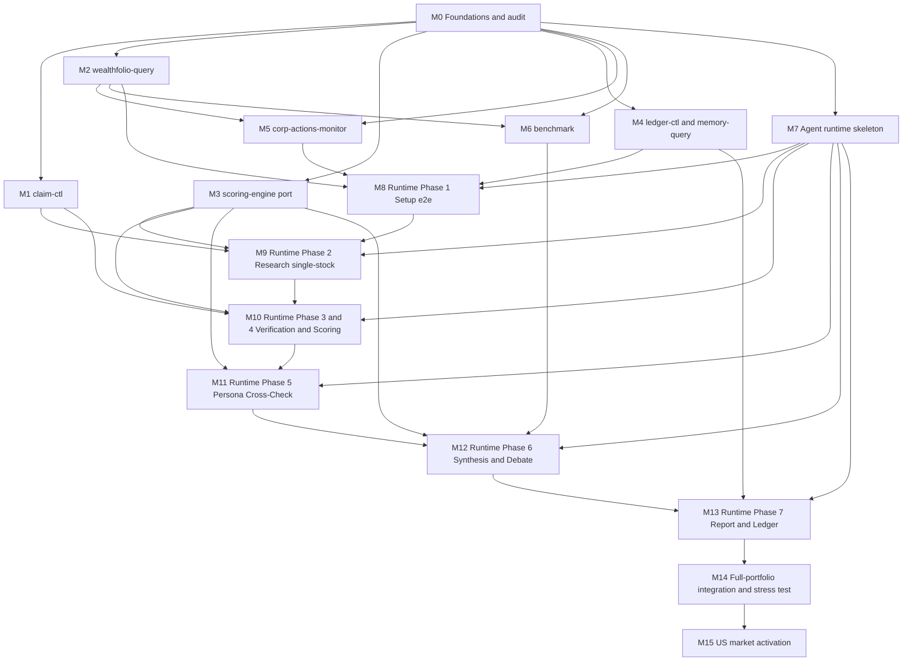

# Implementation Playbook — Local-First AI Portfolio Manager

> Companion to [docs/SPEC.md](SPEC.md). This playbook sequences the *implementation work* needed to make SPEC v1.2 executable. It does not duplicate SPEC content; it names the order, deliverables, and acceptance gates.

---

## 0. How to use this playbook

### 0.1 Milestone vs Phase — terminology

Two different words that look the same. Keep them straight:

| Term | Meaning | Defined in |
|---|---|---|
| **Milestone** (M0–M15) | An implementation deliverable on the path to a working system. Builds once, then stays built. | This playbook |
| **Phase** (1–7) | A step the *running system* performs during a weekly research run. Executes every week. | [SPEC.md §10](SPEC.md) |

Example: **M13** delivers the code and prompts that let the agent execute runtime **Phase 7** every week.

### 0.2 How each milestone maps to `bd`

[CLAUDE.md](../CLAUDE.md) mandates `bd` (beads) for all task tracking. The intended mapping:

- **Each milestone → one `bd` epic.** Title: `Mn: <milestone name>`.
- **Each bullet under Deliverables → a candidate task** under that epic. Use `bd` edges (`blocks`, `parent`) to wire the dependency graph in §1.
- **Acceptance Criteria → the epic's "done when" checklist.** Copy verbatim into the epic body.
- **Risks** are tagged as `bd` issues of type `risk` linked to the epic, so they don't silently disappear.
- No `TodoWrite`, no markdown TODO lists per project rules.

### 0.3 Anatomy of a milestone

Every milestone in §2 uses the same five fields:

- **Goal** — one sentence describing what working code or document exists at the end.
- **Dependencies** — other milestones that must be substantially complete first.
- **Deliverables** — concrete files, scripts, tests, or docs. These become `bd` tasks.
- **Acceptance Criteria** — how we know the milestone is done. Usually a verification command or a check against SPEC.
- **Risks** — known ways this milestone fails or surprises us. Mitigation noted inline.

### 0.4 Scope note — India first

SPEC §8.1 states the US philosophy is currently a template. M0–M14 are India-first; **M15** activates the US market. Do not block early milestones on US content.

---

## 1. Dependency graph

---

## 2. Milestones

### M0 — Foundations & audit

**Goal.** The project has pinned external dependencies, verified upstream schemas and APIs, and a trimmed agent constitution before any runtime code is written.

**Dependencies.** None.

**Deliverables.**
- `THIRD_PARTY.md` at repo root with exact-version pins for: Wealthfolio release, `virattt/ai-hedge-fund` commit SHA, finstack-mcp version, NseKit-MCP version, nse-bse-mcp version. Each entry includes license text and a one-line rationale for the pin.
- Local Wealthfolio install + `.schema` dump committed to `research/wealthfolio-schema-<release>.txt` for reference.
- `skills/sql/wealthfolio-queries.sql` v1 — stub file containing the named-query skeletons listed in [SPEC §5.3](SPEC.md) with placeholder SQL that matches the dumped schema.
- MCP registration smoke-test log (`research/mcp-smoke-test.md`) proving that finstack-mcp, NseKit-MCP, and nse-bse-mcp each return data for at least one India ticker and one US ticker from the agent's session.
- `input/india/philosophy.md` migrated into the SPEC §7.6 shape: YAML front-matter with thresholds + sector exceptions + `personas_enabled` + `persona_rotation`, followed by the full current prose body unchanged.
- `input/india/theses.yaml` scaffolded with the current holdings (values may be empty strings).
- `config/wealthfolio.md` (must include clear instructions on locating the UI's SQLite file and setting up Docker volume mounts), `config/mcp-servers.md`, `config/benchmark-tickers.md` authored per SPEC §17.
- Docker environment defined (`Dockerfile` and `docker-compose.yml`) at the repo root to containerize the Python/Shell skill layer, ensuring maximum portability without manual system dependencies.
- `.agents/directory-contract.md` — table mapping every `temp/research/*` artifact to its producer phase + consumer phase + authoritative owner, per SPEC §2 principle 4.
- [CLAUDE.md](../CLAUDE.md) rewritten to under 80 lines, with the 5 most critical invariants from SPEC §19 at the top: (1) agent never writes Wealthfolio DB, (2) Phase 1 snapshot is frozen, (3) deterministic math vs LLM narrative, (4) immediate-action cap = 2, (5) no fabrication. Existing Beads integration block preserved.
- [AGENTS.md](../AGENTS.md) mirrors CLAUDE.md where sensible; existing non-interactive shell guidance preserved.

**Acceptance Criteria.**
- `sqlite3 -readonly $WEALTHFOLIO_DB '.schema'` succeeds and matches the committed dump.
- For each MCP, at least one tool call from a fresh Claude/Cursor session returns non-empty data for `RELIANCE.NS` and `AAPL`.
- `python -c "import yaml; yaml.safe_load(open('input/india/philosophy.md').read().split('---')[1])"` parses without error and contains `thresholds.non_financial.roe_min`.
- [CLAUDE.md](../CLAUDE.md) line count ≤ 80 (excluding the Beads integration block).

**Risks.**
- Wealthfolio schema drift between release cadence and our pin (SPEC §19.14). Mitigation: the pin is explicit; any Wealthfolio upgrade is its own ticket.
- MCP India coverage gaps surface before M5. Mitigation: log gaps into `research/mcp-gaps.md` and revisit in M5/M14.

---

### M1 — `claim-ctl`

**Goal.** Atomic per-stock claim locks work across parallel Cursor/Claude sessions on the user's machine.

**Dependencies.** M0 (directory contract).

**Deliverables.**
- `skills/scripts/claim-stocks.sh`, `complete-stock.sh`, `check-progress.sh`, `reclaim-stale.sh` implementing the Phase-2 variant per SPEC §6.7, §18.8.
- Phase-4 variants: `claim-scoring.sh`, `complete-scoring.sh`, `check-scoring-progress.sh`, `reclaim-scoring-stale.sh`. `complete-scoring.sh` must fail if the target stock file lacks a `## Scoring` section (SPEC §19 validation).
- Phase-5 variants: `claim-persona.sh`, `complete-persona.sh`, `check-persona-progress.sh`, `reclaim-persona-stale.sh`.
- `skills/scripts/validate-prerequisites.sh` per SPEC §18.8.
- `tests/claim-ctl/concurrent.sh` — spawns 3 background shells that all call `claim-stocks 5 $agent` against a 15-ticker seed directory.
- `tests/claim-ctl/stale-reclaim.sh` — claims, sleeps past the stale threshold, runs `reclaim-stale`, asserts re-claimable.
- `skills/scripts/README.md` documenting the macOS NFS atomicity caveat explicitly.

**Acceptance Criteria.**
- The 3-process concurrent test terminates with each of the 15 tickers claimed by **exactly one** agent and no `.claimed` collisions.
- `complete-scoring.sh INFY.NS` exits non-zero when `temp/research/stocks/INFY.NS.md` is missing `## Scoring`.
- `reclaim-stale.sh 30` releases locks whose mtime is older than 30 minutes and leaves fresh ones alone.
- `shellcheck skills/scripts/*.sh` passes.

**Risks.**
- macOS + networked filesystem: `O_EXCL` is not atomic over NFS. Mitigation: README forbids running the tool tree from network-mounted workspaces; acceptance test runs on local filesystem only.
- Signal-killed agents leaving zombie claim directories. Mitigation: `reclaim-stale` covers the recovery path.

---

### M2 — `wealthfolio-query`

**Goal.** A read-only, named-parameter SQL wrapper is the single entry point for all Wealthfolio reads.

**Dependencies.** M0 (schema dump, pinned release).

**Deliverables.**
- `skills/wealthfolio-query/query.sh` wrapping `sqlite3 -readonly`, enforcing parameterized queries via `.parameter set`.
- All six subcommands from SPEC §18.1: `export-snapshot`, `list-holdings`, `get-cash-balance`, `get-net-worth`, `get-avg-cost`, `get-portfolio-twr`. (`get-portfolio-twr` reads `daily_account_valuation` snapshots, not the `activities` table.)
- `skills/sql/wealthfolio-queries.sql` filled in to match the pinned schema, with `-- version: <wealthfolio-release>` header.
- `--format json|csv` support; default JSON except `export-snapshot` (CSV per SPEC §7.1.1).
- `export-snapshot` merges `input/{market}/theses.yaml` into the `thesis` column deterministically; missing thesis is empty string, not an error (SPEC §19.13).
- Test fixture `tests/wealthfolio-query/fixture.db` — a seeded SQLite file with 5 India + 3 US tickers covering stock + ETF + cash. Holdings + quotes + `daily_account_valuation` rows only; no `activities` rows (holdings-only mode).
- `tests/wealthfolio-query/test_queries.sh` exercising every subcommand against the fixture.
- `skills/wealthfolio-query/README.md`.

**Acceptance Criteria.**
- `wealthfolio-query export-snapshot --market india --scope-type market --scope-value india --theses input/india/theses.yaml --output /tmp/snap.csv` produces a CSV whose header exactly matches SPEC §7.1.1.
- Attempting a write via the wrapper (e.g. injecting `UPDATE`) fails because of `-readonly`.
- Every named query in the SQL file has a matching subcommand and a passing test against the fixture.

**Risks.**
- The pinned Wealthfolio release may not expose a quote-refresh command; `export-snapshot` then relies on the user doing that in the app before invoking us (SPEC §5.4). Mitigation: document explicitly; surface as a Phase 1 preflight check in M8.
- Column naming drift across Wealthfolio minor versions. Mitigation: the versioned SQL file is the compatibility layer (SPEC §19.14).

---

### M3 — `scoring-engine` (ported from ai-hedge-fund)

**Goal.** All deterministic scoring math — threshold checks, persona base scores, concentration math — is reproducible from fixtures with zero LLM involvement.

**Dependencies.** M0 (YAML front-matter parse), M2 (for later integration fixtures).

**Deliverables.**
- Port `src/agents/fundamentals.py`, `src/agents/phil_fisher.py`, `src/agents/risk_manager.py` from `virattt/ai-hedge-fund` at the pinned SHA into `skills/scoring-engine/`. Each ported file keeps its upstream path and SHA in a header comment; MIT text added to `THIRD_PARTY.md`.
- Persona modules for MVP roster (SPEC §8.3): `skills/scoring-engine/personas/{jhunjhunwala,buffett,munger,pabrai}.py`. The ported `ai-hedge-fund` personas retain their native internal math scales unimodified to provide distinct alternative viewpoints.
- Primary scorer: `skills/scoring-engine/my_philosophy.py` which calculates the overall 35/20/20/10/15 rubric scores as the exclusive source of truth for the portfolio score, reading thresholds from the philosophy YAML front-matter.
- `skills/scoring-engine/engine.py` CLI with subcommands `check-thresholds`, `persona`, `concentration-check`, `full` per SPEC §18.3.
- Sector-exception handling (SPEC §9.3 `exception`, `effective_threshold`, `pass_with_exception`): `it_mnc`, `psus`, `foreign_sub`, `stock_exchanges` all test-covered.
- `banking_nbfc` scheme with its distinct threshold table (SPEC §7.6).
- Fixture `tests/scoring-engine/infy.json` reproducing the §18.2 sample; test asserts the output JSON matches §9.3 field-for-field.
- Fixture `tests/scoring-engine/hdfcbank.json` exercising `banking_nbfc` with GNPA/NNPA/CASA/NIM/ROA/CAR.
- `skills/scoring-engine/requirements.txt` and `README.md`.

**Acceptance Criteria.**
- `scoring-engine check-thresholds --philosophy input/india/philosophy.md --scheme non_financial --metrics tests/scoring-engine/infy.json` produces JSON equal to SPEC §9.3 (modulo ordering).
- Promoter check for an IT MNC uses `effective_threshold: 10` and marks `pass_with_exception: true`.
- `scoring-engine persona --persona jhunjhunwala --metrics tests/scoring-engine/infy.json` is deterministic (two runs produce identical `sub_scores`, `weighted_score`, `signal`).
- `scoring-engine concentration-check` returns HHI, per-stock vol-adjusted limits, and a correlation matrix given a 10-ticker `holdings.json` fixture.
- Fundamentals-first invariant (SPEC §9.2) test: a 35/35 + 20/20 + 20/20 + 0/15 + 0/10 = 75 input resolves to "Conviction Hold", never lower.

**Risks.**
- ai-hedge-fund upstream may refactor; pin an SHA and do not track HEAD.
- Banking/NBFC scheme differs enough from non-financial that a naive port mis-scores banks. Mitigation: dedicated HDFCBank fixture.
- Dealbreaker edge cases (zero-promoter but structurally exempt like MCX/BSE). Mitigation: `sector_exceptions.stock_exchanges.exempt: true` test path.

---

### M4 — `ledger-ctl` + `memory-query`

**Goal.** Append-only SQLite FTS5 ledger exists, accepts a parsed weekly report, and is searchable.

**Dependencies.** M0.

**Deliverables.**
- `skills/ledger-ctl/schema.sql` implementing SPEC §7.4 exactly (runs, actions, stock_scores, persona_assessments, report_fts virtual table, indexes).
- `skills/ledger-ctl/ledger_ctl.py` with subcommands `init`, `append-run`, `get-run`, `list-runs`, `search`, `export-actions` per SPEC §18.6.
- Report parser: extracts `runs` fields (market, scope, philosophy_hash, overall_confidence, stock_count, portfolio_value, benchmark_alpha_*), one `stock_scores` row per holding, persona rows per holding-persona, and tiered `actions`.
- Append-only enforcement — `ledger_ctl.py` rejects `UPDATE`/`DELETE` at the Python layer; no schema-level triggers (keep it simple).
- `skills/memory-query/memory_query.py` — FTS5 `MATCH` query over `report_fts` with optional market and date-window filters; output per SPEC §6.6.
- `tests/ledger-ctl/append_and_search.sh` — runs `init`, appends a synthetic report assembled per §16.1, verifies all row counts and FTS5 recall.
- READMEs for both skills.

**Acceptance Criteria.**
- `ledger-ctl init` creates the exact schema in §7.4, including the `report_fts` virtual table with `content='runs'`, `content_rowid='id'`.
- Appending a synthetic report with 10 holdings, 3 personas each, and 8 actions produces 1 `runs` row, 10 `stock_scores`, 30 `persona_assessments`, 8 `actions`, and 1 `report_fts` row.
- `memory-query "promoter pledge"` returns the synthetic run with a non-zero relevance score.
- Attempting `ledger-ctl update-run` (or any non-append command) is a documented error — command does not exist.

**Risks.**
- FTS5 `content='runs'` wiring — easy to misconfigure so that `report_fts` is disconnected from `runs.id`. Mitigation: dedicated test inserts a row and searches it.
- Report-template drift breaking the parser silently. Mitigation: parser rejects missing required sections with an explicit error listing the missing header.

---

### M5 — `corp-actions-monitor`

**Goal.** Every Phase 1 run surfaces upcoming and recent corp-action events for held tickers as an informational feed, sourced from market data only.

**Dependencies.** M0 (MCP registration).

**Deliverables.**
- `skills/corp-actions-monitor/monitor.py` implementing SPEC §6.2 + §13 behavior.
- NseKit-MCP primary path; Yahoo `actions` fallback marked as degraded in output.
- Output writer: `temp/research/warnings/corp-actions.md` in the informational format shown in SPEC §13.3 (no severity column).
- `skills/corp-actions-monitor/README.md`.

**Acceptance Criteria.**
- Fixture run produces a markdown table listing the seeded upcoming + past-90d events for held tickers, with source attribution and no severity column.
- With NseKit-MCP disabled, the tool falls back to Yahoo and the output lists the degradation under a "Source degradation" note.
- Tool does not open the Wealthfolio DB at all (verified by absence of any file handle on the DB path during test runs).
- Exit code is 0 on successful scan; non-zero only on tool failure.

**Risks.**
- MCP coverage for Indian bonuses / mergers is uneven. The informational feed flags `source: Yahoo fallback` when NseKit is unavailable; the user accepts that the feed is best-effort.

---

### M6 — `benchmark`

**Goal.** Alpha numbers per standard window are computable programmatically for India and US portfolios.

**Dependencies.** M0, M2 (TWR source).

**Deliverables.**
- `skills/benchmark/benchmark.py` with CLI per SPEC §18.5.
- `yfinance` wrapper for `^NSEI` and `^GSPC`; configurable benchmark tickers via `config/benchmark-tickers.md`.
- Windows: `1w`, `1m`, `3m`, `1y`, `3y`, `inception`.
- Portfolio TWR computed from `daily_account_valuation` snapshots via `wealthfolio-query get-portfolio-twr`. In holdings-only mode, this snapshot series is the single source of truth — no transaction-derived fallback.
- Output JSON with alpha per window, benchmark TWR per window, portfolio TWR per window.
- Markdown output mode that formats the §16.1 benchmark comparison table.
- `^NSEI` labeled as **price-return** in the markdown output (SPEC §14.3).
- `tests/benchmark/test_alpha.py` — hand-computed expected alpha for a 2-ticker fixture portfolio over 1m window.
- `skills/benchmark/requirements.txt` and `README.md`.

**Acceptance Criteria.**
- Fixture portfolio produces an alpha that matches the hand-computed value within 1 basis point.
- Running twice with the same inputs produces identical output (determinism modulo Yahoo price revisions; in tests, prices are stubbed).
- Markdown output contains the phrase "price-return (no dividend reinvestment)" adjacent to `^NSEI` rows.
- When the requested window exceeds available snapshot history, output marks that window `insufficient_history` and the overall exit code remains 0.

**Risks.**
- Yahoo rate limits and occasional ticker outages. Mitigation: cache raw price arrays under `temp/research/` for the run so retries are free.
- Portfolio TWR is derived from Wealthfolio's `daily_account_valuation` snapshots as the sole source; there is no transaction-derived fallback. When a requested window lacks sufficient snapshot history, that window degrades to `insufficient_history` rather than failing the run.

---

### M7 — Agent runtime skeleton (prompts + commands)

**Goal.** Every markdown file the agent reads during a run exists and follows the directory layout in SPEC §17.

**Dependencies.** M0.

**Deliverables.**
- `.agents/portfolio-research/phases/phase-{1..7}-*.md` authored as **numbered step-by-step procedures, not prose**. Each references the SPEC section it implements and embeds only the invariants relevant to that phase.
- `.agents/portfolio-research/workflows/portfolio-research.md` overview linking all phase files.
- `.agents/portfolio-research/frameworks/{research-methodology,analysis-frameworks,concentration-framework}.md`.
- `.agents/portfolio-research/guidelines/{rules,quality-checklist}.md`.
- `.agents/portfolio-research/templates/{weekly-report-template,stock-analysis-template,stock-research-output-template,context-ledger-template}.md` matching SPEC §16.1 / §7.3 / §7.5.
- `.agents/personas/my-philosophy.md` (generated from `input/india/philosophy.md` front-matter + prose), `jhunjhunwala.md`, `buffett.md`, `munger.md`, `pabrai.md`, plus `graham.md`, `fisher.md`, `damodaran.md`, `lynch.md` (enabled opt-in per SPEC §8.3). Each persona file follows the 5-section shape in SPEC §8.2.
- `.agents/personas/README.md`.
- `.agents/debate/bull.md` and `.agents/debate/bear.md` with variables `{ticker}`, `{score}`, `{persona_verdicts}`, `{current_price}`, `{avg_cost}`, `{allocation_pct}`, `{fund_block}`, `{valu_block}`, `{biz_block}`, `{news_block}`, `{concentration_note}` per SPEC §11.4. Templates explicitly forbid fabrication and encode the 2-round cap + no-new-facts-round-2 rule.
- `.claude/commands/phase{1..7}.md`, `memory.md`, `progress.md` as thin shims — each command loads the matching phase file and the relevant template.
- Linter: `tests/prompts/lint.sh` that scans every `.agents/` file for TODO markers and for disallowed patterns (e.g. `Latest` / `Current` / `TTM` in prompt examples).

**Acceptance Criteria.**
- Opening `.agents/portfolio-research/phases/phase-1-setup.md` shows a numbered list of steps (no more than two paragraphs of prose at the top).
- Grepping all phase files returns zero occurrences of `Latest`, `Current`, or `TTM` as literal examples (these are forbidden per SPEC §19 inv. 7 and §10.4 check 3).
- The 21 SPEC invariants are discoverable: 5 in [CLAUDE.md](../CLAUDE.md), the remaining 16 referenced by number in the phase prompt where they are actionable.
- Each slash command file is ≤ 20 lines.

**Risks.**
- Instruction-following cliff as prompts accumulate (SPEC drafting note, reinforced by the original Humanlayer guidance). Mitigation: each phase prompt embeds only *its* invariants; CLAUDE.md stays ≤ 80 lines.
- Prompt drift between phases that share variables (e.g. `[Tag]` format). Mitigation: templates are the single source; phase prompts reference the template, do not inline it.

---

### M8 — Runtime Phase 1 (Setup) end-to-end

**Goal.** `/phase1 market=india scope_type=market scope_value=india` runs from a fresh session and produces every artifact SPEC §10.2 requires.

**Dependencies.** M2, M4, M5, M7.

**Deliverables.**
- `.agents/portfolio-research/phases/phase-1-setup.md` filled out with the 10 steps from SPEC §10.2.
- Preflight check step that verifies (a) Wealthfolio DB path, (b) schema version matches the pinned SQL file, (c) Wealthfolio has refreshed quotes (if the pinned release exposes a way to check; otherwise surface a user reminder).
- Manifest template `temp/research/manifest.md` populated with: snapshot summary, philosophy summary, thesis coverage (% tickers with non-empty thesis), prior-run highlights (top 3 from `memory-query`), warning summary.
- `scope_value` validation against active Wealthfolio accounts / account groups (SPEC §10.2 step 2).
- `tests/e2e/phase1.sh` — runs `/phase1` against the M2 fixture Wealthfolio DB and asserts every required artifact exists.

**Acceptance Criteria.**
- After a clean `rm -rf temp/research && /phase1 market=india scope_type=market scope_value=india`, these files exist: `portfolio-snapshot.csv`, `warnings/corp-actions.md`, `manifest.md`, and `claims/{TICKER}/` for every snapshot row.
- Snapshot CSV column headers match SPEC §7.1.1 exactly.
- Re-running `/phase1` without cleaning `temp/research/` produces a clear error ("previous run artifacts present — clean or continue explicitly"), not a silent overwrite.
- Snapshot-freeze invariant: intentionally mutating `portfolio-snapshot.csv` after Phase 1 produces a `tests/invariants/snapshot-frozen.sh` violation that later phases must detect.

**Risks.**
- Accidentally calling `wealthfolio-query` twice and ending up with two mutually-inconsistent snapshots (e.g. price refresh between calls). Mitigation: Phase 1 writes the snapshot once and all downstream steps read from the CSV, not from Wealthfolio directly (SPEC §19.12).

---

### M9 — Runtime Phase 2 (Research) — single-stock slice

**Goal.** A single ticker (RELIANCE.NS) passes all the way through Phase 2 and produces a valid `[Tag]` stock file.

**Dependencies.** M1, M3, M7, M8.

**Deliverables.**
- `.agents/portfolio-research/phases/phase-2-research.md` — numbered procedure with: claim batch → for each ticker, load snapshot row → fundamentals-fetch via MCP → web search for qualitative → compose `[Tag]` file → complete. Snapshot-freeze warning is step 0.
- MCP fallback chain encoded per SPEC §15.2 (Tier A → B → C → D → `N/A`).
- `fundamentals-fetch` aggregator JSON schema (SPEC §18.2) documented in the prompt with an explicit rule: the agent *emits* this shape after aggregating per-MCP responses.
- ETF variant (lighter §9.8 path) tested against NIFTYBEES.NS.
- `tests/e2e/single-stock.sh` — runs Phase 1 + Phase 2 for `RELIANCE.NS` and asserts the resulting stock file has every required `[Tag]` line.
- Stock-file linter `tests/stocks/lint.sh` — rejects any stock file that (a) lacks a period annotation on any fundamental, (b) cites `Latest`/`Current`/`TTM`, (c) has fewer than 2 unique source domains.

**Acceptance Criteria.**
- `single-stock.sh` produces `temp/research/stocks/RELIANCE.NS.md` containing `[Overview]`, `[Fund]`, `[Valu]`, `[Biz]`, `[News]`, `[Phil]`, `[Prev]`, `[Sources]` — all with period annotations.
- `NIFTYBEES.NS` test produces a stock file on the lighter ETF path per SPEC §9.8.
- Stock-file linter passes on both.
- After Phase 2, `portfolio-snapshot.csv` is byte-identical to the Phase 1 output.

**Risks.**
- MCP partial-data returning empty strings instead of `N/A`. Mitigation: the aggregator normalizes to `N/A` and logs the missing fields to the stock file's `missing_fields` (SPEC §18.2).
- Web search leaking fabricated numbers. Mitigation: the linter rejects numbers lacking a `[Sources]` entry.

---

### M10 — Runtime Phases 3 + 4 (Verification + Scoring)

**Goal.** Stock files pass an automated verification gate and then receive a `## Scoring` block produced by parallel scoring sessions.

**Dependencies.** M1 (scoring claim variants), M3, M7, M9.

**Deliverables.**
- `.agents/portfolio-research/phases/phase-3-verification.md` — 6 checks from SPEC §10.4. Written as a deterministic checklist; the agent reports violations, does not fix them.
- `.agents/portfolio-research/phases/phase-4-scoring.md` — procedure: claim → parse `[Fund]`+`[Valu]` into metrics JSON → `scoring-engine check-thresholds` → compose `## Scoring` block → complete-scoring (which validates the block).
- Metrics extractor `skills/scripts/extract-metrics.sh` — strips `[Fund]` and `[Valu]` lines into the JSON shape `scoring-engine` expects.
- Fundamentals-first invariant test fixtures (SPEC §9.2): deliberately rich-valuation-but-strong-fundamentals ticker must not fall below Conviction Hold.
- Dealbreaker fixtures (SPEC §9.3): zero-promoter non-exempt, confirmed fraud, `[Phil] Thesis: SELL`.
- `tests/e2e/phase3-4.sh` — runs Phase 3 + Phase 4 on a 5-ticker batch across 3 parallel sessions.

**Acceptance Criteria.**
- Verification rejects a deliberately corrupted stock file missing period annotations and logs each violation in `temp/research/verification-notes.md`.
- On the fundamentals-first fixture, the emitted action is `Hold` or `Hold-with-Conviction`, never `Exit` or `Trim`.
- On the dealbreaker fixture, `philosophy_fit` is 0 and the `Action` reflects the break per SPEC §9.3.
- 3-session parallel scoring run completes with exactly one `## Scoring` block per ticker and no duplicate writes.

**Risks.**
- `[Fund]` parsing is fragile to whitespace drift. Mitigation: the extractor is strict and errors loudly on ambiguity.
- Agent tempted to re-derive thresholds instead of quoting from the scoring-engine output (SPEC §9.3). Mitigation: phase-4 prompt includes invariant 15 (deterministic math, LLM narrative) by number.

---

### M11 — Runtime Phase 5 (Persona Cross-Check)

**Goal.** Every non-ETF stock gets a `## Persona Cross-Check` block; rotation is deterministic per `(run_date, market)`; `my-philosophy` is always present.

**Dependencies.** M3 (persona modules), M7 (persona markdown files), M10.

**Deliverables.**
- `.agents/portfolio-research/phases/phase-5-persona-crosscheck.md` — procedure per SPEC §10.6.
- Rotation seed algorithm: deterministic hash of `(run_date, market)` modulo the enabled-persona pool, excluding `my-philosophy`. Spec'd in the phase prompt; implemented in `skills/scripts/persona-rotation.sh`.
- ETF bypass per SPEC §10.6 step 3 — skip persona rotation, record the ETF-specific analysis path in the stock file.
- `my-philosophy` generator (at M7) paired with a test that asserts its persona module reads the YAML thresholds correctly.
- `tests/e2e/phase5.sh` — runs Phase 5 on the M10 batch, asserts the rotation roster is stable across re-runs with the same `(run_date, market)`.

**Acceptance Criteria.**
- For a fixed `(run_date, market)` pair, two successive Phase 5 runs select the same persona roster.
- `my-philosophy` appears first in every `## Persona Cross-Check` block (invariant 16).
- ETF tickers have no rotating-persona lines and include the ETF-skip note.
- Disagreement between `my-philosophy` and any rotating persona sets a `Flags: debate-trigger-reason` line for M12 to consume.

**Risks.**
- Rotation seeded from non-stable input (wall clock, run id) breaks reproducibility. Mitigation: seed is `(run_date, market)` only, nothing else.
- Persona prompts drifting toward each other and producing near-identical verdicts. Mitigation: each persona file keeps its distinct threshold/weight block from SPEC §8.2 step 3.

---

### M12 — Runtime Phase 6 (Synthesis + Selective Debate)

**Goal.** Concentration sanity runs, debate triggers fire exactly on SPEC §11.2 rules, and `portfolio-analysis.md` is assembled.

**Dependencies.** M3 (`concentration-check`), M6 (benchmark), M7 (debate templates), M11.

**Deliverables.**
- `.agents/portfolio-research/phases/phase-6-synthesis-debate.md` covering the 3-step sequence from SPEC §10.7: concentration → selective debate → portfolio synthesis.
- Debate-trigger selector `skills/scripts/select-debate.sh` — scans all stock files for the four triggers in SPEC §11.2 (persona disagreement, mixed 40–65 + fundamentals intact, price drawdown past `price_down_debate_trigger_pct`, allocation past `position_concentration_debate_trigger_pct`). Deduplicates per SPEC §11.2 final rule. Writes `temp/research/debate-queue.md`.
- Map-Reduce preprocessing step: `select-debate.sh` condenses un-flagged tickers into a 1-line summary to preserve the LLM's attention span. Only the actively flagged stocks retain their full `[Tag]` data in the LLM's context window.
- Skip rules encoded: score ≥ 80 unanimous skips debate; score ≤ 30 with confirmed dealbreaker skips debate.
- Debate loop in the phase prompt: round 1 (bull + bear with cited evidence) → optional round 2 rebuttal → resolution. 2-round cap enforced. No-new-facts-round-2 rule explicit.
- Portfolio-analysis assembler producing `temp/research/portfolio-analysis.md` per SPEC §16.5 with executive summary, score distribution, sector allocation, position-sizing violations, concentration block from `concentration-check.md`, debate summary, tiered action plan (Immediate cap = 2).
- `tests/e2e/phase6.sh` — fixtures for each of the 4 trigger types; asserts debate fires on each and is skipped on the two skip cases.

**Acceptance Criteria.**
- Each of the 4 trigger fixtures yields a `## Debate` section in the corresponding stock file.
- The score-≥-80-unanimous fixture and the score-≤-30-dealbreaker fixture both skip debate and have no `## Debate` section.
- Immediate-action list in `portfolio-analysis.md` has at most 2 entries, even if more triggers were present (SPEC §3.5 cap, invariant 10).
- `concentration-check.md` reports HHI + per-stock `(current_pct, vol_adjusted_limit, delta)` + top-5 correlation pairs.

**Risks.**
- Over-triggering debate and drowning the report in noise. Mitigation: the skip rules for high-conviction unanimous and clear dealbreakers are mandatory (SPEC §11.2), enforced by fixtures.
- Resolver introducing facts not raised in round 1/2. Mitigation: debate template's closing instructions explicitly forbid this; phase-6 prompt references invariant "no new facts" by name.

---

### M13 — Runtime Phase 7 (Report Assembly + Ledger)

**Goal.** The weekly report exists on disk, the ledger row is committed, and the context ledger is rotated — all atomically enough that a partial run is obvious.

**Dependencies.** M4, M7, M12.

**Deliverables.**
- `.agents/portfolio-research/phases/phase-7-report.md` — mechanical assembly per SPEC §10.8 (no new analysis).
- Report template `reports/{market}/YYYY-MM-DD-weekly-report.md` matching SPEC §16.1 section-for-section.
- JSON-first logging mechanism: The phase produces a structured `report_data.json` describing the analysis (runs, scores, personas, actions) which `ledger-ctl` securely ingests, safeguarding against Markdown parsing fragility.
- A deterministic script mechanically concatenates the LLM-synthesized executive summary and action plan with the uncut, raw `[Tag]` data of every portfolio holding to render `.reports/{market}/YYYY-MM-DD-weekly-report.md` for human review without data loss.
- `philosophy_hash` computed as `sha256(philosophy.md)` and stored in `runs.philosophy_hash`; Phase 1 (M8) reads this on the next run and surfaces "philosophy changed — confirm re-baselining" to the user (SPEC §19.20).
- Context-ledger writer: `context/{market}/last-run.md` rotation (current → `last-run-backup.md`, then write new) per SPEC §7.5.
- Optional cleanup prompt for `temp/research/` (not required).
- `tests/e2e/phase7.sh` — runs Phase 7 against a synthetic Phase 6 output; asserts the report file exists, the ledger row counts match §16.2 expectations, the context ledger is ≤ 100 lines, and the previous context was backed up.

**Acceptance Criteria.**
- `reports/india/YYYY-MM-DD-weekly-report.md` contains every section from SPEC §16.1 in order.
- `ledger-ctl get-run <id>` returns the row types and counts listed in SPEC §16.2.
- Modifying `philosophy.md` between two runs causes the second `/phase1` to emit a "philosophy changed" prompt; the stored `philosophy_hash` on the previous `runs` row differs from the computed one for the new philosophy.
- `context/india/last-run.md` line count ≤ 100; `last-run-backup.md` equals the prior run's context.

**Risks.**
- Partial ledger write on interrupt leaving an inconsistent DB. Mitigation: single transaction in `append-run`.
- Report-parser brittleness feeding back into ledger integrity. Mitigation: parser errors loudly and the transaction is rolled back.

---

### M14 — Full-portfolio integration + stress test

**Goal.** A real India portfolio completes all 7 runtime phases across 3 parallel Cursor/Claude sessions, survives a kill-mid-batch, and surfaces any MCP coverage gaps.

**Dependencies.** M1–M13.

**Deliverables.**
- `tests/e2e/full-portfolio.sh` — drives Phase 1 through Phase 7 on a ≥ 15-ticker real India portfolio snapshot (user-provided fixture or anonymized copy).
- `tests/e2e/stress-parallel.sh` — spawns 3 concurrent sessions for Phases 2, 4, 5; verifies partitioning.
- `tests/e2e/kill-midbatch.sh` — claims a batch, SIGKILLs the shell, sleeps past stale threshold, runs `reclaim-*-stale`, verifies re-claim and completion.
- `research/mcp-coverage-audit.md` — manual audit comparing promoter %, pledge %, and sector PE for 5 Indian tickers against Screener.in. Maps each field to the exact MCP call (SPEC §15.1–§15.3). Any gap opens a `bd` issue.
- Post-run checklist: ledger grows by exactly one row; `context/india/last-run.md` updated; `reports/india/YYYY-MM-DD-weekly-report.md` present and well-formed.

**Acceptance Criteria.**
- Full-portfolio run completes; `Immediate` action list has ≤ 2 entries.
- Parallel stress test never produces duplicate work.
- Kill-mid-batch test resumes without manual intervention other than `reclaim-*-stale`.
- MCP-coverage audit either passes (all 5 tickers match Screener within tolerance) or lists every discrepancy with an assigned `bd` issue id.

**Risks.**
- Cumulative prompt drift across 7 phases producing subtly wrong reports that pass individual milestone tests. Mitigation: this milestone's full-portfolio test is the only real guardrail.
- User philosophy may not actually match the YAML front-matter shape assumed in M0. Mitigation: treat this as the validation of that migration; fix back in M0's artifact, don't patch downstream.

---

### M15 — US market activation

**Goal.** `/phase1..7 market=us` runs end-to-end against a US portfolio with the same code paths used for India.

**Dependencies.** M14.

**Deliverables.**
- `input/us/philosophy.md` filled in by the user, with YAML front-matter complete (thresholds, position_sizing, risk, `personas_enabled`, `persona_rotation`).
- `input/us/theses.yaml` with current US holdings.
- `context/us/last-run.md` scaffold.
- Verification that finstack-mcp SEC tools (`get_sec_filing`, etc.) return 10-K/10-Q metadata for a sample US ticker.
- `^GSPC` benchmark path exercised via `tests/benchmark/test_alpha.py` US fixture.
- US persona fixtures (Buffett / Munger / Pabrai behave well on a US ticker; Jhunjhunwala appropriately flagged as India-only per SPEC §8.3).
- `tests/e2e/full-portfolio-us.sh`.

**Acceptance Criteria.**
- Full US portfolio run completes; report lands at `reports/us/YYYY-MM-DD-weekly-report.md` with §16.1 sections.
- Jhunjhunwala persona is either not in the US `personas_enabled` list or correctly self-skips on US tickers.
- SEC Tier-1 tools cited in at least one US stock file `[Sources]` line.

**Risks.**
- US philosophy may not yet reflect the user's actual approach (it is explicitly a template in SPEC §8.1). Mitigation: this milestone is partly a content task; no US runs produce useful output until the philosophy is real.

---

## 3. Cross-cutting concerns

These run alongside milestones, not as their own epics. File them as `bd` issues attached to whichever milestone surfaces them.

### 3.1 Testing strategy

- **Unit tests** per skill, living in `tests/<skill>/`. Fixtures include:
  - INFY (SPEC §18.2) — non-financial scoring + Phil Fisher weighting.
  - A sample Indian bank (e.g. HDFCBANK.NS) — banking/NBFC scheme.
  - An IT MNC (e.g. INFY.NS) — `it_mnc` sector exception.
  - A PSU (e.g. COALINDIA.NS) — `psus` exception.
  - A stock exchange (e.g. BSE.NS or MCX.NS) — structurally promoter-less exempt.
- **Integration tests** per milestone (`tests/e2e/<milestone>.sh`).
- **End-to-end** at M9 (single-stock) and M14 (full portfolio).
- **Invariant tests** in `tests/invariants/`: snapshot-frozen, ledger-append-only, Wealthfolio-never-written, no-fabrication-linter.

### 3.2 Linting and quality gates

- `shellcheck` on every `skills/scripts/*.sh` — runs in M1's acceptance.
- `ruff` or equivalent on every Python skill.
- Prompt linter from M7 — forbids `Latest`/`Current`/`TTM`, enforces `[Tag]` format.
- Report linter — validates a report parses cleanly into the ledger before commit.

### 3.3 Documentation touchpoints

- `README.md` at repo root — one-paragraph purpose, quick-start, link to SPEC + playbook.
- `THIRD_PARTY.md` — all ported code attributions; updated in M0, M3, and whenever a new upstream source is pinned.
- `config/{wealthfolio,mcp-servers,benchmark-tickers}.md` — user-facing configuration.
- Each skill has its own `README.md` covering invocation, contract, failure modes.

### 3.4 Security and safety

- `sqlite3 -readonly` enforced everywhere Wealthfolio is read (M2).
- Parameterized SQL only — no string formatting of user-supplied values (M2).
- No secrets in `config/*.md`; MCP server credentials go into Cursor/Claude config, not the repo.
- Ledger DB lives under user control (`ledger/ledger.db`); no cloud sync implied.

---

*End of playbook v1. Update alongside [docs/SPEC.md](SPEC.md) whenever milestones or acceptance criteria change.*
